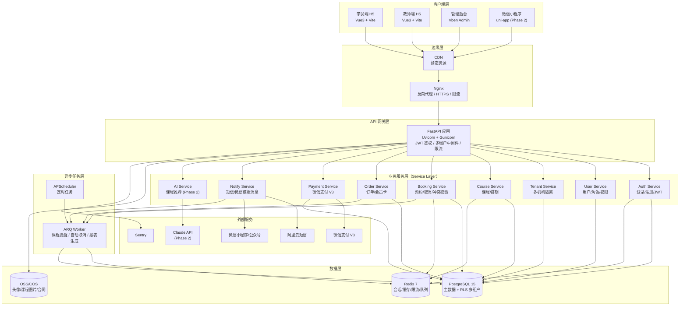
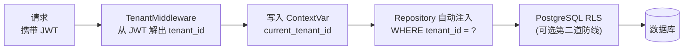
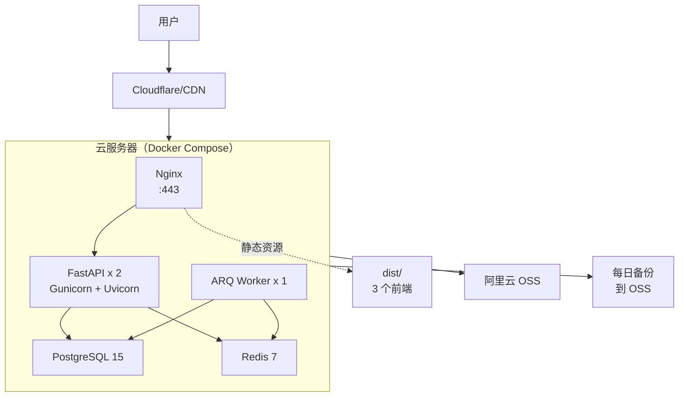
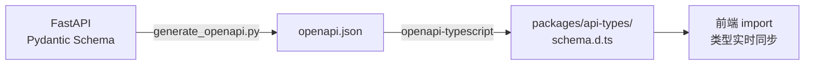
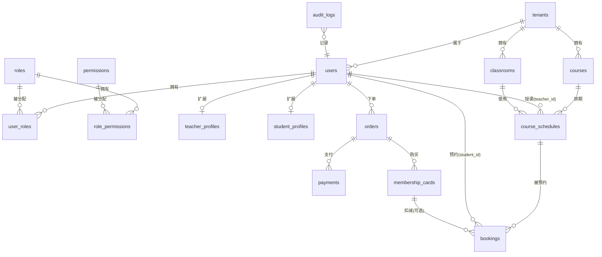
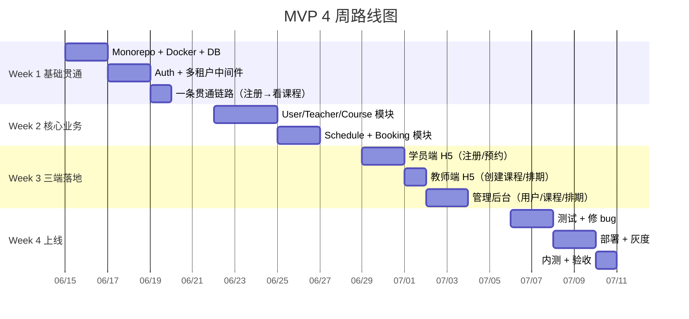
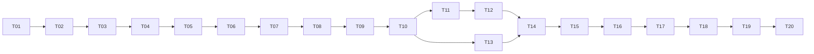

# 舞蹈机构约课 SaaS 系统 - 开发计划

## Context

从0构建一个可上线运营的舞蹈机构 SaaS 约课系统，覆盖学员端、教师端、管理后台。第一阶段聚焦 MVP（注册登录、课程预约、教师课程管理、基础后台），后续扩展微信小程序、会员卡、支付、数据分析、AI 推荐。

**开发者背景**：5 年 Vue 经验（Vue3 + TS + Pinia + Element Plus + Axios），后端经验较少。因此架构选型需优先考虑：学习成本低、开发效率高、单人可维护、未来易扩展。

**输出节奏**：分 7 步交付（技术选型 → 架构图 → 目录结构 → 数据库 → API → 路线图 → Claude Code 任务清单）。本文件随每步交付增量更新，每步完成后等待用户确认再进入下一步。

---

## Step 1 - 技术选型：Node.js + NestJS vs Python + FastAPI

### 1.1 维度对比

#### ① 学习成本


| 维度       | Node.js + NestJS                                             | Python + FastAPI         |
| -------- | ------------------------------------------------------------ | ------------------------ |
| 语言       | ✅ TypeScript，完全复用 Vue3 能力                                    | ❌ 需新学 Python 语法、缩进、虚拟环境  |
| 工具链      | ✅ npm/pnpm/Vite/ESLint 完全相同                                  | ❌ pip/poetry/pytest 全部新学 |
| 架构思想     | ✅ NestJS 的 Module/Provider/DI ≈ Pinia Store + Vue Composable | ⚠️ FastAPI 轻量，需自己设计架构    |
| 装饰器      | ✅ 与 TS 装饰器、Vue Class Component 一致                            | ⚠️ Python 装饰器语法不同        |
| **上手时间** | **1-2 周可写生产代码**                                              | **3-4 周达到生产水平**          |


#### ② 开发效率


| 维度       | NestJS                             | FastAPI                     |
| -------- | ---------------------------------- | --------------------------- |
| 类型共享     | ✅ **前后端共享 TS 类型**（最大优势）            | ❌ 需手维护或借 OpenAPI 生成         |
| ORM      | ✅ Prisma 类型安全 + 迁移友好               | ✅ SQLAlchemy/Tortoise，无类型贯通 |
| 代码生成     | ✅ `nest g resource course` 一键 CRUD | ⚠️ 需手写或借模板                  |
| Monorepo | ✅ pnpm workspace + 前后端共享 utils     | ❌ 跨语言无法共享                   |
| API 文档   | ✅ Swagger 内置                       | ✅ OpenAPI 自动生成（略优）          |


#### ③ 可维护性


| 维度    | NestJS                            | FastAPI     |
| ----- | --------------------------------- | ----------- |
| 架构约束  | ✅ 强制 Module/Controller/Service 分层 | ⚠️ 灵活但易失控   |
| 类型保护  | ✅ 强类型 + 编译期校验                     | ⚠️ 类型提示非强制  |
| 测试支持  | ✅ DI 易于 mock                      | ✅ pytest 成熟 |
| 重构友好度 | ✅ ⭐⭐⭐⭐⭐                           | ⭐⭐⭐         |


#### ④ 招聘市场


| 维度   | NestJS                | FastAPI            |
| ---- | --------------------- | ------------------ |
| 人才池  | ⭐⭐⭐⭐ Node 后端 + 前端转型者多 | ⭐⭐⭐⭐ Python 基数大    |
| 沟通成本 | ✅ 全栈 TS，前后端无壁垒        | ❌ 前后端语言分裂          |
| 国内生态 | ✅ 蚂蚁/字节大量使用 NestJS    | ✅ 字节/美团 FastAPI 也多 |


#### ⑤ AI 扩展能力


| 维度                   | NestJS                          | FastAPI               |
| -------------------- | ------------------------------- | --------------------- |
| 业务级 AI（调 Claude/GPT） | ✅ Anthropic/OpenAI 官方 TS SDK 一流 | ✅ Python SDK 同样一流     |
| 流式输出/Tool Use        | ✅ 原生支持                          | ✅ 原生支持                |
| LangChain            | ✅ langchain.js 完善               | ✅ LangChain Python 更全 |
| 向量库                  | ✅ Pinecone/Qdrant 都有 TS SDK     | ✅ 略优                  |
| 模型微调/训练              | ❌                               | ✅ ⭐⭐⭐⭐⭐               |
| **结论**               | **业务 AI 完全够用**                  | **重 ML 训练才有优势**       |


### 1.2 综合评分


| 维度       | 权重    | NestJS  | FastAPI |
| -------- | ----- | ------- | ------- |
| 学习成本（对你） | ⭐⭐⭐⭐⭐ | 5       | 2       |
| 开发效率     | ⭐⭐⭐⭐⭐ | 5       | 4       |
| 可维护性     | ⭐⭐⭐⭐  | 5       | 4       |
| 招聘市场     | ⭐⭐⭐   | 4       | 4       |
| AI 扩展    | ⭐⭐⭐   | 4       | 5       |
| **加权总分** |       | **108** | **86**  |


### 1.3 最终推荐：**Node.js + NestJS**

**五大核心理由：**

1. **零语言切换** — 你的 TS 能力 1 周内即可写出生产级 NestJS 代码
2. **类型贯通全栈** — 共享 `User`/`Course`/`Booking` 等类型，单人开发效率翻倍
3. **架构思想一致** — NestJS 的 DI/Module/装饰器与 Vue3 Pinia 心智模型同源
4. **业务 AI 够用** — 课程推荐、智能客服等场景 Anthropic SDK 完全胜任
5. **可平滑扩展** — Monorepo + 共享代码 + 统一工具链，最适合单人长期演进

### 1.4 推荐技术栈细化


| 层级          | 技术选型                       | 选型理由                  |
| ----------- | -------------------------- | --------------------- |
| **后端框架**    | NestJS 10.x                | 企业级、模块化、与 Vue3 心智模型一致 |
| **语言**      | TypeScript 5.x             | 全栈统一                  |
| **ORM**     | **Prisma 5.x**             | 类型安全、迁移工具最友好、单人可控     |
| **数据库**     | PostgreSQL 15+             | 功能强、JSON 支持、未来分析友好    |
| **缓存**      | Redis 7.x                  | 标准选择，BullMQ 也依赖它      |
| **认证**      | JWT + Passport             | NestJS 官方推荐           |
| **API 文档**  | Swagger（@nestjs/swagger）   | 装饰器即文档                |
| **文件存储**    | 阿里云 OSS / 腾讯云 COS          | 国内合规，未来对接小程序方便        |
| **消息队列**    | BullMQ                     | 基于 Redis，单人易维护        |
| **支付**      | 微信支付 V3 SDK                | 必备                    |
| **部署**      | Docker + Nginx + PM2       | 单机起步，未来可平迁 K8s        |
| **包管理**     | pnpm（Monorepo）             | 速度快、磁盘友好              |
| **学员端/教师端** | Vue3 + Vite + Element Plus | 复用现有技能                |
| **管理后台**    | Vue3 + Vben Admin          | 开箱即用、文档好              |
| **小程序（未来）** | Taro / uni-app             | Vue 语法、一套代码多端         |


### 1.5 Monorepo 结构预览

```
dance-saas/
├── apps/
│   ├── api/           # NestJS 后端
│   ├── student-web/   # 学员端（H5）
│   ├── teacher-web/   # 教师端（H5）
│   ├── admin/         # 管理后台
│   └── miniapp/       # 微信小程序（Phase 2）
├── packages/
│   ├── shared-types/  # 跨端共享的 TS 类型
│   ├── api-client/    # 自动生成的接口客户端
│   └── utils/         # 通用工具
├── pnpm-workspace.yaml
└── turbo.json         # Turborepo 编排
```

---

### 1.6 用户最终决策（2026-06-11 确认）


| 决策   | 选择                                            |
| ---- | --------------------------------------------- |
| 后端框架 | **FastAPI + Python 3.12**                     |
| 代码组织 | **Monorepo**（pnpm workspace + Turborepo + uv） |
| 多租户  | **从 Day 1 开始**（所有业务表带 `tenant_id`）            |
| 管理后台 | **Vben Admin (Vue3)**                         |


### 1.7 基于 FastAPI 的最终技术栈


| 层级           | 选型                                        | 说明                           |
| ------------ | ----------------------------------------- | ---------------------------- |
| **后端框架**     | FastAPI 0.115+                            | 类型注解 + 自动 OpenAPI            |
| **语言**       | Python 3.12                               | 性能最好的稳定版                     |
| **包管理**      | uv                                        | Ruff 团队出品，速度比 pip 快 10-100 倍 |
| **ORM**      | SQLAlchemy 2.0（async）                     | 行业标准、生态最全                    |
| **迁移工具**     | Alembic                                   | SQLAlchemy 配套                |
| **数据校验**     | Pydantic V2                               | FastAPI 内置                   |
| **认证**       | python-jose + Passlib                     | JWT + bcrypt                 |
| **数据库**      | PostgreSQL 15+                            | RLS 支持多租户                    |
| **缓存/队列**    | Redis 7 + ARQ/Celery                      | ARQ 更轻量、async 友好             |
| **任务编排**     | APScheduler 或 ARQ                         | 课程提醒、自动取消                    |
| **文件存储**     | 阿里云 OSS / 腾讯云 COS                         | 国内合规                         |
| **支付**       | wechatpayv3                               | 微信支付官方推荐 SDK                 |
| **AI 接入**    | anthropic Python SDK                      | 课程推荐/智能客服                    |
| **API 类型同步** | **openapi-typescript**                    | 后端 OpenAPI → 前端 .d.ts        |
| **学员端/教师端**  | Vue3 + Vite + Element Plus + VueUse       | 复用现有技能                       |
| **管理后台**     | Vben Admin (Vue3)                         | 节省 2 周                       |
| **小程序（未来）**  | uni-app + Vue3 语法                         | 一套代码多端                       |
| **代码质量**     | Ruff + mypy + pre-commit                  | Lint + 类型检查                  |
| **测试**       | pytest + pytest-asyncio + httpx           | 异步测试                         |
| **部署**       | Docker Compose + Nginx + Gunicorn/Uvicorn | 单机起步                         |
| **监控**       | Sentry + Prometheus + Grafana             | 错误追踪 + 指标                    |


---

## Step 2 - 系统架构设计

### 2.1 整体架构图




### 2.2 多租户隔离方案（Day 1 即生效）




**实现要点：**

- 共享数据库 + 共享 Schema + 行级隔离（`tenant_id` 列）
- 业务表统一带 `tenant_id NOT NULL` + 联合索引 `(tenant_id, ...)`
- FastAPI 中间件解析 JWT 注入 `ContextVar`，SQLAlchemy 全局事件自动追加 `WHERE tenant_id`
- 平台超管（运营/客服）可跨租户：通过 `platform_role` 跳过过滤
- 第二道防线：PostgreSQL Row Level Security（生产环境强制开启）

### 2.3 部署架构（MVP 单机版）




**部署演进路径：**


| 阶段  | 架构                   | 适用规模         |
| --- | -------------------- | ------------ |
| MVP | 单机 Docker Compose    | < 1000 DAU   |
| 成长期 | App/DB/Redis 分离 + 主备 | 1k - 10k DAU |
| 规模化 | K8s + 读写分离 + 队列集群    | > 10k DAU    |


### 2.4 数据流关键链路

**① 学员预约课程（核心链路）**

```
学员 → FastAPI → BookingService
   → Redis 分布式锁（防超额预约）
   → 校验：课程是否存在 / 是否在预约期 / 容量是否充足 / 学员是否已约
   → PG 事务：写 booking + 课程剩余位 -1
   → ARQ 异步：发送预约成功通知 + 创建上课前提醒任务
   → 返回学员
```

**② 支付链路（Phase 2）**

```
学员下单 → 创建 order（状态 pending）
   → 调微信支付 V3 统一下单 → 返回 prepay_id
   → 学员前端拉起支付
   → 微信回调 → PaymentService 验签 → 幂等更新 order（paid）
   → 触发会员卡发放 / 课时充值 → 通知学员
```

### 2.5 安全设计


| 维度     | 方案                                                                         |
| ------ | -------------------------------------------------------------------------- |
| 传输     | 全站 HTTPS (Let's Encrypt)                                                   |
| 认证     | JWT (Access 2h + Refresh 7d)，Refresh 存 Redis 可吊销                           |
| 密码     | bcrypt (cost=12)                                                           |
| 权限     | RBAC：`User - Role - Permission`，装饰器 `@require_permission("course:create")` |
| 多租户    | 中间件 + RLS 双保险                                                              |
| 限流     | slowapi（基于 Redis）                                                          |
| CSRF   | JWT in Header（非 Cookie）天然防 CSRF                                            |
| SQL 注入 | SQLAlchemy ORM 参数化                                                         |
| 文件上传   | OSS 直传 + 后端签发临时凭证，限制类型/大小                                                  |
| 敏感操作   | 审计日志表 `audit_logs`（who/when/what）                                          |
| 密钥管理   | `.env` + Docker secrets，生产用 KMS                                            |


---

## Step 3 - 项目目录结构

### 3.1 Monorepo 顶层结构

```
dance-saas/
├── apps/                          # 应用层（可独立部署的单元）
│   ├── api/                       # FastAPI 后端（详见 3.2）
│   ├── student-web/               # 学员端 H5（Vue3 + Vite）
│   ├── teacher-web/               # 教师端 H5（Vue3 + Vite）
│   ├── admin/                     # 管理后台（Vben Admin）
│   └── miniapp/                   # 微信小程序（uni-app, Phase 2）
│
├── packages/                      # 共享包（跨 app 复用）
│   ├── api-types/                 # openapi-typescript 生成的 TS 类型
│   ├── api-client/                # axios 封装 + 拦截器
│   ├── shared-ui/                 # 跨端 Vue 组件
│   ├── utils/                     # 跨端工具（日期/格式化/校验）
│   └── config/                    # 共享 ESLint / TS / Prettier 配置
│
├── infra/                         # 基础设施
│   ├── docker/
│   │   ├── docker-compose.yml             # 本地开发
│   │   ├── docker-compose.prod.yml        # 生产
│   │   ├── api.Dockerfile
│   │   └── nginx.Dockerfile
│   ├── nginx/nginx.conf
│   └── scripts/                   # 备份 / 部署 / 初始化
│
├── docs/                          # 项目文档
│   ├── architecture.md
│   ├── database.md
│   ├── api.md
│   └── deployment.md
│
├── .github/workflows/             # CI/CD
│   ├── api-ci.yml
│   └── web-ci.yml
│
├── .env.example
├── pnpm-workspace.yaml
├── turbo.json                     # Turborepo 编排
├── package.json                   # 根级脚本
└── README.md
```

### 3.2 后端 `apps/api/` 详细结构（DDD 分层）

```
apps/api/
├── pyproject.toml                 # uv 管理依赖
├── uv.lock
├── alembic.ini
├── .env.example
├── Dockerfile
│
├── alembic/
│   ├── env.py
│   └── versions/                  # 自动生成的迁移文件
│
├── src/app/
│   ├── main.py                    # FastAPI 实例入口
│   │
│   ├── core/                      # 核心基础设施（与业务无关）
│   │   ├── config.py              # Pydantic Settings 配置
│   │   ├── database.py            # SQLAlchemy AsyncEngine / Session
│   │   ├── redis.py               # Redis 连接池
│   │   ├── security.py            # JWT 编解码 / 密码哈希
│   │   ├── logger.py              # 结构化日志
│   │   ├── exceptions.py          # 自定义异常类
│   │   ├── tenant_context.py      # ContextVar 多租户上下文
│   │   └── pagination.py          # 通用分页模型
│   │
│   ├── middleware/                # 中间件
│   │   ├── tenant.py              # 解析 JWT 注入 tenant_id
│   │   ├── auth.py                # JWT 验证
│   │   ├── logging.py
│   │   ├── rate_limit.py          # 限流
│   │   └── error_handler.py       # 全局异常 → 统一响应
│   │
│   ├── modules/                   # ⭐ 业务模块（按领域划分）
│   │   ├── auth/                  # 认证
│   │   │   ├── router.py          # HTTP 入口
│   │   │   ├── service.py         # 业务逻辑
│   │   │   ├── repository.py      # 数据访问
│   │   │   ├── schemas.py         # Pydantic DTO
│   │   │   ├── models.py          # SQLAlchemy 模型
│   │   │   ├── dependencies.py    # Depends
│   │   │   └── exceptions.py
│   │   ├── tenant/                # 租户（机构）
│   │   ├── user/                  # 用户/角色/权限
│   │   ├── teacher/
│   │   ├── student/
│   │   ├── course/
│   │   ├── schedule/              # 课程排期
│   │   ├── booking/               # 预约
│   │   ├── order/                 # Phase 2
│   │   ├── payment/               # Phase 2
│   │   ├── notification/          # 短信/微信
│   │   ├── upload/                # OSS 直传凭证
│   │   └── ai/                    # Phase 2
│   │
│   ├── shared/                    # 跨模块共享
│   │   ├── base_model.py          # Base / TenantMixin / TimestampMixin
│   │   ├── base_repository.py     # 通用 Repository 基类
│   │   ├── base_schema.py         # 通用响应包装
│   │   └── enums.py
│   │
│   ├── workers/                   # ARQ 异步任务
│   │   ├── main.py
│   │   ├── booking_tasks.py       # 提醒 / 自动取消
│   │   ├── notification_tasks.py
│   │   └── report_tasks.py
│   │
│   └── integrations/              # 外部服务封装
│       ├── wechat_pay.py
│       ├── wechat_mp.py
│       ├── aliyun_sms.py
│       ├── oss.py
│       └── anthropic_client.py
│
├── tests/
│   ├── conftest.py                # pytest fixtures
│   ├── unit/                      # Service / Repository 单测
│   ├── integration/               # API 集成测试
│   └── e2e/                       # 端到端关键链路
│
├── scripts/
│   ├── seed.py                    # 种子数据
│   └── generate_openapi.py        # 导出 openapi.json
│
└── README.md
```

**每个 module 的 6 文件约定（DDD 分层）**


| 文件                | 职责                                    | 类比 Vue3 心智模型         |
| ----------------- | ------------------------------------- | -------------------- |
| `router.py`       | HTTP 入口，路由 + 参数校验 + 调用 service        | Vue Component        |
| `service.py`      | 业务逻辑、编排、事务边界                          | Pinia Action         |
| `repository.py`   | 数据访问，封装 SQLAlchemy 查询                 | Pinia State + Getter |
| `models.py`       | SQLAlchemy ORM 表定义                    | DB Schema            |
| `schemas.py`      | Pydantic 入/出参 DTO                     | TS interface         |
| `dependencies.py` | FastAPI Depends（如 `get_current_user`） | Vue Composable       |


**调用方向（严禁反向依赖）**：

```
router → service → repository → models
         ↓
       schemas (数据契约)
```

### 3.3 前端 `apps/student-web/` 结构（教师端同模板）

```
apps/student-web/
├── package.json
├── vite.config.ts
├── tsconfig.json
├── .env.development
├── .env.production
├── index.html
│
└── src/
    ├── main.ts
    ├── App.vue
    │
    ├── api/                       # API 调用层
    │   ├── http.ts                # 复用 @dance-saas/api-client
    │   └── modules/
    │       ├── auth.ts
    │       ├── course.ts
    │       └── booking.ts
    │
    ├── assets/                    # 图片/字体/全局样式
    ├── components/                # 业务组件
    ├── composables/               # Vue Composable
    │   ├── useAuth.ts
    │   ├── usePagination.ts
    │   └── useRequest.ts
    │
    ├── stores/                    # Pinia
    │   ├── user.ts
    │   └── booking.ts
    │
    ├── views/                     # 页面
    │   ├── login/
    │   ├── courses/
    │   ├── booking/
    │   └── profile/
    │
    ├── router/
    │   ├── index.ts
    │   └── guards.ts              # 路由守卫
    │
    ├── layouts/
    │   ├── DefaultLayout.vue
    │   └── BlankLayout.vue
    │
    ├── utils/                     # 局部工具
    ├── constants/
    └── types/                     # 引用 @dance-saas/api-types
```

### 3.4 共享包说明


| 包                        | 内容                                   | 使用方       |
| ------------------------ | ------------------------------------ | --------- |
| `@dance-saas/api-types`  | openapi-typescript 生成的 TS 类型         | 所有前端      |
| `@dance-saas/api-client` | axios 实例 + JWT/错误/重试拦截器              | 所有前端      |
| `@dance-saas/shared-ui`  | 跨端 Vue 组件（CourseCard/Calendar/Empty） | 学员端 + 教师端 |
| `@dance-saas/utils`      | 日期/格式化/校验（dayjs 封装）                  | 所有前端      |
| `@dance-saas/config`     | 共享 ESLint/TS/Prettier 配置             | 所有前端      |


### 3.5 类型同步方案（补足 Python/TS 跨语言）




- `turbo.json` 定义 `gen:types` pipeline
- pre-commit hook 自动跑，保证 Pydantic 改动后前端类型立刻刷新
- 这是替代 NestJS "全栈类型贯通" 的关键工程实践

### 3.6 Turborepo 关键脚本


| 命令                | 作用                    |
| ----------------- | --------------------- |
| `pnpm dev`        | 同时启动 api + 三个前端       |
| `pnpm build`      | 全量构建                  |
| `pnpm gen:types`  | 后端 OpenAPI → 前端 TS 类型 |
| `pnpm lint`       | 全部 lint               |
| `pnpm test`       | 全部测试                  |
| `pnpm db:migrate` | Alembic 迁移            |
| `pnpm db:seed`    | 种子数据                  |


---

## Step 4 - 数据库设计

### 4.1 设计原则


| 原则    | 落地方式                                              |
| ----- | ------------------------------------------------- |
| 多租户隔离 | 所有业务表带 `tenant_id`，联合索引以 `tenant_id` 为前导列         |
| 软删除   | 关键业务表加 `deleted_at TIMESTAMP NULL`，查询自动过滤         |
| 时间戳   | 统一 `created_at` / `updated_at`，触发器自动维护            |
| 主键    | 全部 `BIGSERIAL`（性能 + 简单）。对外暴露用 UUID 字段 `public_id` |
| 命名    | 表名复数小写 + 下划线，字段小写下划线                              |
| 金额    | `NUMERIC(12,2)`（分单位也可选 BIGINT，本设计用元）              |
| 时区    | 全部 `TIMESTAMPTZ`（UTC 存储 + 应用层转换）                  |
| 外键    | 强外键约束 + `ON DELETE` 显式声明                          |


### 4.2 ER 图（MVP + Phase 2 预留）




### 4.3 表结构详细说明

#### ① `tenants` 租户（机构）


| 字段            | 类型                          | 说明             |
| ------------- | --------------------------- | -------------- |
| id            | BIGSERIAL PK                | 主键             |
| public_id     | UUID UNIQUE                 | 对外暴露 ID        |
| name          | VARCHAR(100) NOT NULL       | 机构名            |
| slug          | VARCHAR(50) UNIQUE NOT NULL | 子域名/路径标识       |
| logo_url      | VARCHAR(500)                | Logo           |
| contact_phone | VARCHAR(20)                 |                |
| contact_email | VARCHAR(100)                |                |
| status        | SMALLINT NOT NULL DEFAULT 1 | 1=正常 0=停用      |
| plan          | VARCHAR(20) DEFAULT 'free'  | free/basic/pro |
| settings      | JSONB DEFAULT '{}'          | 营业时间/规则等       |
| created_at    | TIMESTAMPTZ                 |                |
| updated_at    | TIMESTAMPTZ                 |                |


**索引**：`UNIQUE(slug)`, `INDEX(status)`

#### ② `users` 用户（统一表）


| 字段                                   | 类型                    | 说明                      |
| ------------------------------------ | --------------------- | ----------------------- |
| id                                   | BIGSERIAL PK          |                         |
| public_id                            | UUID UNIQUE           | 对外 ID                   |
| tenant_id                            | BIGINT FK→tenants.id  | 所属机构                    |
| phone                                | VARCHAR(20) NOT NULL  | 手机号（登录用）                |
| email                                | VARCHAR(100)          | 可选                      |
| password_hash                        | VARCHAR(255) NOT NULL | bcrypt                  |
| nickname                             | VARCHAR(50)           |                         |
| real_name                            | VARCHAR(50)           |                         |
| avatar_url                           | VARCHAR(500)          |                         |
| gender                               | SMALLINT              | 0=未知 1=男 2=女            |
| birthday                             | DATE                  |                         |
| platform_role                        | VARCHAR(20)           | NULL/super_admin（跨租户超管） |
| status                               | SMALLINT DEFAULT 1    | 1=正常 0=禁用               |
| last_login_at                        | TIMESTAMPTZ           |                         |
| created_at / updated_at / deleted_at | TIMESTAMPTZ           |                         |


**索引**：

- `UNIQUE(tenant_id, phone) WHERE deleted_at IS NULL`
- `UNIQUE(tenant_id, email) WHERE deleted_at IS NULL AND email IS NOT NULL`
- `INDEX(tenant_id, status)`

#### ③ `roles` 角色


| 字段                      | 类型                    | 说明                                       |
| ----------------------- | --------------------- | ---------------------------------------- |
| id                      | BIGSERIAL PK          |                                          |
| tenant_id               | BIGINT FK→tenants.id  | NULL=平台内置角色                              |
| code                    | VARCHAR(50) NOT NULL  | student/teacher/tenant_admin/super_admin |
| name                    | VARCHAR(50)           | 显示名                                      |
| description             | VARCHAR(255)          |                                          |
| is_system               | BOOLEAN DEFAULT false | 系统内置不可删                                  |
| created_at / updated_at | TIMESTAMPTZ           |                                          |


**索引**：`UNIQUE(tenant_id, code)`

#### ④ `permissions` 权限


| 字段          | 类型                           | 说明                |
| ----------- | ---------------------------- | ----------------- |
| id          | BIGSERIAL PK                 |                   |
| code        | VARCHAR(100) UNIQUE NOT NULL | 如 `course:create` |
| name        | VARCHAR(100)                 |                   |
| module      | VARCHAR(50)                  | 所属模块              |
| description | VARCHAR(255)                 |                   |


#### ⑤ `user_roles` 用户-角色关联


| 字段         | 类型                 |
| ---------- | ------------------ |
| user_id    | BIGINT FK→users.id |
| role_id    | BIGINT FK→roles.id |
| created_at | TIMESTAMPTZ        |


**主键**：`(user_id, role_id)`

#### ⑥ `role_permissions` 角色-权限关联


| 字段            | 类型                       |
| ------------- | ------------------------ |
| role_id       | BIGINT FK→roles.id       |
| permission_id | BIGINT FK→permissions.id |


**主键**：`(role_id, permission_id)`

#### ⑦ `teacher_profiles` 教师扩展


| 字段                      | 类型                        | 说明        |
| ----------------------- | ------------------------- | --------- |
| id                      | BIGSERIAL PK              |           |
| user_id                 | BIGINT UNIQUE FK→users.id |           |
| tenant_id               | BIGINT FK→tenants.id      | 冗余便于查询    |
| title                   | VARCHAR(100)              | 职称        |
| bio                     | TEXT                      | 简介        |
| specialties             | TEXT[]                    | 擅长舞种      |
| years_of_experience     | SMALLINT                  | 教龄        |
| status                  | SMALLINT DEFAULT 1        | 1=在职 0=离职 |
| created_at / updated_at | TIMESTAMPTZ               |           |


#### ⑧ `student_profiles` 学员扩展


| 字段                      | 类型                        | 说明          |
| ----------------------- | ------------------------- | ----------- |
| id                      | BIGSERIAL PK              |             |
| user_id                 | BIGINT UNIQUE FK→users.id |             |
| tenant_id               | BIGINT FK→tenants.id      |             |
| emergency_contact_name  | VARCHAR(50)               | 紧急联系人       |
| emergency_contact_phone | VARCHAR(20)               |             |
| level                   | VARCHAR(20)               | 入门/初级/中级/高级 |
| tags                    | TEXT[]                    | 标签          |
| notes                   | TEXT                      | 备注          |
| created_at / updated_at | TIMESTAMPTZ               |             |


#### ⑨ `classrooms` 教室


| 字段                      | 类型                   | 说明     |
| ----------------------- | -------------------- | ------ |
| id                      | BIGSERIAL PK         |        |
| tenant_id               | BIGINT FK→tenants.id |        |
| name                    | VARCHAR(50) NOT NULL | A 教室   |
| capacity                | SMALLINT NOT NULL    | 最大容量   |
| equipment               | TEXT[]               | 镜子/音响等 |
| status                  | SMALLINT DEFAULT 1   |        |
| created_at / updated_at | TIMESTAMPTZ          |        |


**索引**：`UNIQUE(tenant_id, name)`

#### ⑩ `courses` 课程（**模板**）


| 字段                                   | 类型                     | 说明              |
| ------------------------------------ | ---------------------- | --------------- |
| id                                   | BIGSERIAL PK           |                 |
| public_id                            | UUID UNIQUE            |                 |
| tenant_id                            | BIGINT FK→tenants.id   |                 |
| name                                 | VARCHAR(100) NOT NULL  | 少儿芭蕾初级          |
| category                             | VARCHAR(50)            | 舞种              |
| level                                | VARCHAR(20)            | 难度              |
| cover_url                            | VARCHAR(500)           |                 |
| description                          | TEXT                   |                 |
| duration_minutes                     | SMALLINT NOT NULL      | 单节时长            |
| max_capacity                         | SMALLINT NOT NULL      | 默认容量            |
| price                                | NUMERIC(10,2) NOT NULL | 单节价格（Phase 2 用） |
| required_credits                     | SMALLINT DEFAULT 1     | 消耗课时数           |
| status                               | SMALLINT DEFAULT 1     | 1=上架 0=下架       |
| created_at / updated_at / deleted_at | TIMESTAMPTZ            |                 |


**索引**：`INDEX(tenant_id, status)`, `INDEX(tenant_id, category)`

#### ⑪ `course_schedules` 课程排期（**具体一节课**）


| 字段                      | 类型                          | 说明               |
| ----------------------- | --------------------------- | ---------------- |
| id                      | BIGSERIAL PK                |                  |
| public_id               | UUID UNIQUE                 |                  |
| tenant_id               | BIGINT FK→tenants.id        |                  |
| course_id               | BIGINT FK→courses.id        |                  |
| teacher_id              | BIGINT FK→users.id          |                  |
| classroom_id            | BIGINT FK→classrooms.id     |                  |
| start_at                | TIMESTAMPTZ NOT NULL        | 开始时间             |
| end_at                  | TIMESTAMPTZ NOT NULL        | 结束时间             |
| capacity                | SMALLINT NOT NULL           | 本节容量（可覆盖模板）      |
| booked_count            | SMALLINT NOT NULL DEFAULT 0 | 已预约数             |
| booking_opens_at        | TIMESTAMPTZ                 | 开放预约时间           |
| booking_closes_at       | TIMESTAMPTZ                 | 截止预约时间           |
| cancel_deadline         | TIMESTAMPTZ                 | 可取消截止            |
| status                  | SMALLINT DEFAULT 1          | 1=正常 2=已取消 3=已结束 |
| notes                   | TEXT                        |                  |
| created_at / updated_at | TIMESTAMPTZ                 |                  |


**索引**：

- `INDEX(tenant_id, start_at)` — 按时间查询课表
- `INDEX(tenant_id, teacher_id, start_at)` — 教师课表
- `INDEX(tenant_id, classroom_id, start_at)` — 教室冲突检查
- `CHECK(end_at > start_at)`
- `CHECK(booked_count <= capacity)`

#### ⑫ `bookings` 预约


| 字段                      | 类型                            | 说明                           |
| ----------------------- | ----------------------------- | ---------------------------- |
| id                      | BIGSERIAL PK                  |                              |
| public_id               | UUID UNIQUE                   |                              |
| tenant_id               | BIGINT FK→tenants.id          |                              |
| schedule_id             | BIGINT FK→course_schedules.id |                              |
| student_id              | BIGINT FK→users.id            |                              |
| status                  | SMALLINT NOT NULL             | 1=已预约 2=已取消 3=已签到 4=已完课 5=爽约 |
| source                  | VARCHAR(20) DEFAULT 'self'    | self/admin/teacher           |
| membership_card_id      | BIGINT NULL                   | Phase 2：扣的哪张卡                |
| booked_at               | TIMESTAMPTZ NOT NULL          |                              |
| cancelled_at            | TIMESTAMPTZ                   |                              |
| cancelled_reason        | VARCHAR(255)                  |                              |
| checked_in_at           | TIMESTAMPTZ                   |                              |
| created_at / updated_at | TIMESTAMPTZ                   |                              |


**索引**：

- `UNIQUE(schedule_id, student_id) WHERE status IN (1,3,4)` — 防重复预约
- `INDEX(tenant_id, student_id, status)` — "我的预约"
- `INDEX(tenant_id, schedule_id, status)` — 课程已约名单

#### ⑬ `audit_logs` 审计日志


| 字段          | 类型           | 说明                 |
| ----------- | ------------ | ------------------ |
| id          | BIGSERIAL PK |                    |
| tenant_id   | BIGINT       |                    |
| user_id     | BIGINT       | 操作者                |
| action      | VARCHAR(100) | 如 `booking.create` |
| target_type | VARCHAR(50)  | 如 `booking`        |
| target_id   | BIGINT       |                    |
| payload     | JSONB        | 变更前后               |
| ip          | INET         |                    |
| user_agent  | VARCHAR(500) |                    |
| created_at  | TIMESTAMPTZ  |                    |


**索引**：`INDEX(tenant_id, created_at)`, `INDEX(tenant_id, user_id, created_at)`

#### Phase 2 预留表（先建表结构，MVP 不写代码）

`**membership_cards` 会员卡**：tenant_id / student_id / card_type / total_credits / used_credits / expire_at / status
`**orders` 订单**：tenant_id / user_id / order_no / item_type / item_id / amount / status / paid_at
`**payments` 支付流水**：order_id / channel / out_trade_no / transaction_id / amount / status / raw_response

### 4.4 完整 SQL（PostgreSQL 15+）

```sql
-- ============================================
-- 通用函数：自动更新 updated_at
-- ============================================
CREATE OR REPLACE FUNCTION trigger_set_updated_at()
RETURNS TRIGGER AS $$
BEGIN
    NEW.updated_at = NOW();
    RETURN NEW;
END;
$$ LANGUAGE plpgsql;

-- ============================================
-- 1. tenants 租户
-- ============================================
CREATE TABLE tenants (
    id              BIGSERIAL PRIMARY KEY,
    public_id       UUID NOT NULL DEFAULT gen_random_uuid() UNIQUE,
    name            VARCHAR(100) NOT NULL,
    slug            VARCHAR(50) NOT NULL UNIQUE,
    logo_url        VARCHAR(500),
    contact_phone   VARCHAR(20),
    contact_email   VARCHAR(100),
    status          SMALLINT NOT NULL DEFAULT 1,
    plan            VARCHAR(20) NOT NULL DEFAULT 'free',
    settings        JSONB NOT NULL DEFAULT '{}',
    created_at      TIMESTAMPTZ NOT NULL DEFAULT NOW(),
    updated_at      TIMESTAMPTZ NOT NULL DEFAULT NOW()
);
CREATE INDEX idx_tenants_status ON tenants(status);
CREATE TRIGGER set_tenants_updated_at BEFORE UPDATE ON tenants
    FOR EACH ROW EXECUTE FUNCTION trigger_set_updated_at();

-- ============================================
-- 2. users 用户
-- ============================================
CREATE TABLE users (
    id              BIGSERIAL PRIMARY KEY,
    public_id       UUID NOT NULL DEFAULT gen_random_uuid() UNIQUE,
    tenant_id       BIGINT NOT NULL REFERENCES tenants(id) ON DELETE RESTRICT,
    phone           VARCHAR(20) NOT NULL,
    email           VARCHAR(100),
    password_hash   VARCHAR(255) NOT NULL,
    nickname        VARCHAR(50),
    real_name       VARCHAR(50),
    avatar_url      VARCHAR(500),
    gender          SMALLINT,
    birthday        DATE,
    platform_role   VARCHAR(20),
    status          SMALLINT NOT NULL DEFAULT 1,
    last_login_at   TIMESTAMPTZ,
    created_at      TIMESTAMPTZ NOT NULL DEFAULT NOW(),
    updated_at      TIMESTAMPTZ NOT NULL DEFAULT NOW(),
    deleted_at      TIMESTAMPTZ
);
CREATE UNIQUE INDEX uq_users_tenant_phone ON users(tenant_id, phone) WHERE deleted_at IS NULL;
CREATE UNIQUE INDEX uq_users_tenant_email ON users(tenant_id, email)
    WHERE deleted_at IS NULL AND email IS NOT NULL;
CREATE INDEX idx_users_tenant_status ON users(tenant_id, status);
CREATE TRIGGER set_users_updated_at BEFORE UPDATE ON users
    FOR EACH ROW EXECUTE FUNCTION trigger_set_updated_at();

-- ============================================
-- 3. roles 角色
-- ============================================
CREATE TABLE roles (
    id              BIGSERIAL PRIMARY KEY,
    tenant_id       BIGINT REFERENCES tenants(id) ON DELETE CASCADE,
    code            VARCHAR(50) NOT NULL,
    name            VARCHAR(50) NOT NULL,
    description     VARCHAR(255),
    is_system       BOOLEAN NOT NULL DEFAULT FALSE,
    created_at      TIMESTAMPTZ NOT NULL DEFAULT NOW(),
    updated_at      TIMESTAMPTZ NOT NULL DEFAULT NOW()
);
CREATE UNIQUE INDEX uq_roles_tenant_code ON roles(COALESCE(tenant_id, 0), code);
CREATE TRIGGER set_roles_updated_at BEFORE UPDATE ON roles
    FOR EACH ROW EXECUTE FUNCTION trigger_set_updated_at();

-- ============================================
-- 4. permissions 权限
-- ============================================
CREATE TABLE permissions (
    id              BIGSERIAL PRIMARY KEY,
    code            VARCHAR(100) NOT NULL UNIQUE,
    name            VARCHAR(100) NOT NULL,
    module          VARCHAR(50) NOT NULL,
    description     VARCHAR(255)
);

-- ============================================
-- 5. user_roles
-- ============================================
CREATE TABLE user_roles (
    user_id         BIGINT NOT NULL REFERENCES users(id) ON DELETE CASCADE,
    role_id         BIGINT NOT NULL REFERENCES roles(id) ON DELETE CASCADE,
    created_at      TIMESTAMPTZ NOT NULL DEFAULT NOW(),
    PRIMARY KEY (user_id, role_id)
);

-- ============================================
-- 6. role_permissions
-- ============================================
CREATE TABLE role_permissions (
    role_id         BIGINT NOT NULL REFERENCES roles(id) ON DELETE CASCADE,
    permission_id   BIGINT NOT NULL REFERENCES permissions(id) ON DELETE CASCADE,
    PRIMARY KEY (role_id, permission_id)
);

-- ============================================
-- 7. teacher_profiles
-- ============================================
CREATE TABLE teacher_profiles (
    id                  BIGSERIAL PRIMARY KEY,
    user_id             BIGINT NOT NULL UNIQUE REFERENCES users(id) ON DELETE CASCADE,
    tenant_id           BIGINT NOT NULL REFERENCES tenants(id) ON DELETE CASCADE,
    title               VARCHAR(100),
    bio                 TEXT,
    specialties         TEXT[],
    years_of_experience SMALLINT,
    status              SMALLINT NOT NULL DEFAULT 1,
    created_at          TIMESTAMPTZ NOT NULL DEFAULT NOW(),
    updated_at          TIMESTAMPTZ NOT NULL DEFAULT NOW()
);
CREATE INDEX idx_teacher_profiles_tenant ON teacher_profiles(tenant_id, status);
CREATE TRIGGER set_teacher_profiles_updated_at BEFORE UPDATE ON teacher_profiles
    FOR EACH ROW EXECUTE FUNCTION trigger_set_updated_at();

-- ============================================
-- 8. student_profiles
-- ============================================
CREATE TABLE student_profiles (
    id                          BIGSERIAL PRIMARY KEY,
    user_id                     BIGINT NOT NULL UNIQUE REFERENCES users(id) ON DELETE CASCADE,
    tenant_id                   BIGINT NOT NULL REFERENCES tenants(id) ON DELETE CASCADE,
    emergency_contact_name      VARCHAR(50),
    emergency_contact_phone     VARCHAR(20),
    level                       VARCHAR(20),
    tags                        TEXT[],
    notes                       TEXT,
    created_at                  TIMESTAMPTZ NOT NULL DEFAULT NOW(),
    updated_at                  TIMESTAMPTZ NOT NULL DEFAULT NOW()
);
CREATE INDEX idx_student_profiles_tenant ON student_profiles(tenant_id);
CREATE TRIGGER set_student_profiles_updated_at BEFORE UPDATE ON student_profiles
    FOR EACH ROW EXECUTE FUNCTION trigger_set_updated_at();

-- ============================================
-- 9. classrooms
-- ============================================
CREATE TABLE classrooms (
    id              BIGSERIAL PRIMARY KEY,
    tenant_id       BIGINT NOT NULL REFERENCES tenants(id) ON DELETE CASCADE,
    name            VARCHAR(50) NOT NULL,
    capacity        SMALLINT NOT NULL,
    equipment       TEXT[],
    status          SMALLINT NOT NULL DEFAULT 1,
    created_at      TIMESTAMPTZ NOT NULL DEFAULT NOW(),
    updated_at      TIMESTAMPTZ NOT NULL DEFAULT NOW()
);
CREATE UNIQUE INDEX uq_classrooms_tenant_name ON classrooms(tenant_id, name);
CREATE TRIGGER set_classrooms_updated_at BEFORE UPDATE ON classrooms
    FOR EACH ROW EXECUTE FUNCTION trigger_set_updated_at();

-- ============================================
-- 10. courses 课程模板
-- ============================================
CREATE TABLE courses (
    id                BIGSERIAL PRIMARY KEY,
    public_id         UUID NOT NULL DEFAULT gen_random_uuid() UNIQUE,
    tenant_id         BIGINT NOT NULL REFERENCES tenants(id) ON DELETE CASCADE,
    name              VARCHAR(100) NOT NULL,
    category          VARCHAR(50),
    level             VARCHAR(20),
    cover_url         VARCHAR(500),
    description       TEXT,
    duration_minutes  SMALLINT NOT NULL,
    max_capacity      SMALLINT NOT NULL,
    price             NUMERIC(10,2) NOT NULL DEFAULT 0,
    required_credits  SMALLINT NOT NULL DEFAULT 1,
    status            SMALLINT NOT NULL DEFAULT 1,
    created_at        TIMESTAMPTZ NOT NULL DEFAULT NOW(),
    updated_at        TIMESTAMPTZ NOT NULL DEFAULT NOW(),
    deleted_at        TIMESTAMPTZ
);
CREATE INDEX idx_courses_tenant_status ON courses(tenant_id, status) WHERE deleted_at IS NULL;
CREATE INDEX idx_courses_tenant_category ON courses(tenant_id, category);
CREATE TRIGGER set_courses_updated_at BEFORE UPDATE ON courses
    FOR EACH ROW EXECUTE FUNCTION trigger_set_updated_at();

-- ============================================
-- 11. course_schedules 排期
-- ============================================
CREATE TABLE course_schedules (
    id                  BIGSERIAL PRIMARY KEY,
    public_id           UUID NOT NULL DEFAULT gen_random_uuid() UNIQUE,
    tenant_id           BIGINT NOT NULL REFERENCES tenants(id) ON DELETE CASCADE,
    course_id           BIGINT NOT NULL REFERENCES courses(id) ON DELETE RESTRICT,
    teacher_id          BIGINT NOT NULL REFERENCES users(id) ON DELETE RESTRICT,
    classroom_id        BIGINT REFERENCES classrooms(id) ON DELETE SET NULL,
    start_at            TIMESTAMPTZ NOT NULL,
    end_at              TIMESTAMPTZ NOT NULL,
    capacity            SMALLINT NOT NULL,
    booked_count        SMALLINT NOT NULL DEFAULT 0,
    booking_opens_at    TIMESTAMPTZ,
    booking_closes_at   TIMESTAMPTZ,
    cancel_deadline     TIMESTAMPTZ,
    status              SMALLINT NOT NULL DEFAULT 1,
    notes               TEXT,
    created_at          TIMESTAMPTZ NOT NULL DEFAULT NOW(),
    updated_at          TIMESTAMPTZ NOT NULL DEFAULT NOW(),
    CONSTRAINT chk_schedule_time CHECK (end_at > start_at),
    CONSTRAINT chk_schedule_capacity CHECK (booked_count <= capacity AND booked_count >= 0)
);
CREATE INDEX idx_schedules_tenant_start ON course_schedules(tenant_id, start_at);
CREATE INDEX idx_schedules_teacher_start ON course_schedules(tenant_id, teacher_id, start_at);
CREATE INDEX idx_schedules_classroom_start ON course_schedules(tenant_id, classroom_id, start_at);
CREATE INDEX idx_schedules_course ON course_schedules(course_id);
CREATE TRIGGER set_schedules_updated_at BEFORE UPDATE ON course_schedules
    FOR EACH ROW EXECUTE FUNCTION trigger_set_updated_at();

-- ============================================
-- 12. bookings 预约
-- ============================================
CREATE TABLE bookings (
    id                   BIGSERIAL PRIMARY KEY,
    public_id            UUID NOT NULL DEFAULT gen_random_uuid() UNIQUE,
    tenant_id            BIGINT NOT NULL REFERENCES tenants(id) ON DELETE CASCADE,
    schedule_id          BIGINT NOT NULL REFERENCES course_schedules(id) ON DELETE RESTRICT,
    student_id           BIGINT NOT NULL REFERENCES users(id) ON DELETE RESTRICT,
    status               SMALLINT NOT NULL,
    source               VARCHAR(20) NOT NULL DEFAULT 'self',
    membership_card_id   BIGINT,
    booked_at            TIMESTAMPTZ NOT NULL DEFAULT NOW(),
    cancelled_at         TIMESTAMPTZ,
    cancelled_reason     VARCHAR(255),
    checked_in_at        TIMESTAMPTZ,
    created_at           TIMESTAMPTZ NOT NULL DEFAULT NOW(),
    updated_at           TIMESTAMPTZ NOT NULL DEFAULT NOW()
);
-- 防重复预约（活跃状态唯一）
CREATE UNIQUE INDEX uq_bookings_schedule_student_active
    ON bookings(schedule_id, student_id)
    WHERE status IN (1, 3, 4);
CREATE INDEX idx_bookings_student ON bookings(tenant_id, student_id, status);
CREATE INDEX idx_bookings_schedule ON bookings(tenant_id, schedule_id, status);
CREATE TRIGGER set_bookings_updated_at BEFORE UPDATE ON bookings
    FOR EACH ROW EXECUTE FUNCTION trigger_set_updated_at();

-- ============================================
-- 13. audit_logs
-- ============================================
CREATE TABLE audit_logs (
    id              BIGSERIAL PRIMARY KEY,
    tenant_id       BIGINT,
    user_id         BIGINT,
    action          VARCHAR(100) NOT NULL,
    target_type     VARCHAR(50),
    target_id       BIGINT,
    payload         JSONB,
    ip              INET,
    user_agent      VARCHAR(500),
    created_at      TIMESTAMPTZ NOT NULL DEFAULT NOW()
);
CREATE INDEX idx_audit_tenant_created ON audit_logs(tenant_id, created_at DESC);
CREATE INDEX idx_audit_user_created ON audit_logs(tenant_id, user_id, created_at DESC);

-- ============================================
-- Phase 2 预留：membership_cards / orders / payments
-- ============================================
CREATE TABLE membership_cards (
    id                BIGSERIAL PRIMARY KEY,
    public_id         UUID NOT NULL DEFAULT gen_random_uuid() UNIQUE,
    tenant_id         BIGINT NOT NULL REFERENCES tenants(id) ON DELETE CASCADE,
    student_id        BIGINT NOT NULL REFERENCES users(id) ON DELETE RESTRICT,
    card_type         VARCHAR(20) NOT NULL,             -- count/period/unlimited
    total_credits     INTEGER,
    used_credits      INTEGER NOT NULL DEFAULT 0,
    valid_from        TIMESTAMPTZ,
    expire_at         TIMESTAMPTZ,
    status            SMALLINT NOT NULL DEFAULT 1,
    created_at        TIMESTAMPTZ NOT NULL DEFAULT NOW(),
    updated_at        TIMESTAMPTZ NOT NULL DEFAULT NOW()
);
CREATE INDEX idx_cards_student ON membership_cards(tenant_id, student_id, status);

CREATE TABLE orders (
    id              BIGSERIAL PRIMARY KEY,
    public_id       UUID NOT NULL DEFAULT gen_random_uuid() UNIQUE,
    tenant_id       BIGINT NOT NULL REFERENCES tenants(id) ON DELETE CASCADE,
    user_id         BIGINT NOT NULL REFERENCES users(id) ON DELETE RESTRICT,
    order_no        VARCHAR(32) NOT NULL UNIQUE,
    item_type       VARCHAR(20) NOT NULL,                -- card/course
    item_id         BIGINT NOT NULL,
    amount          NUMERIC(10,2) NOT NULL,
    status          SMALLINT NOT NULL DEFAULT 0,         -- 0=待支付 1=已支付 2=已取消 3=已退款
    paid_at         TIMESTAMPTZ,
    cancelled_at    TIMESTAMPTZ,
    expire_at       TIMESTAMPTZ,
    created_at      TIMESTAMPTZ NOT NULL DEFAULT NOW(),
    updated_at      TIMESTAMPTZ NOT NULL DEFAULT NOW()
);
CREATE INDEX idx_orders_user ON orders(tenant_id, user_id, status);
CREATE INDEX idx_orders_status_created ON orders(tenant_id, status, created_at DESC);

CREATE TABLE payments (
    id                  BIGSERIAL PRIMARY KEY,
    public_id           UUID NOT NULL DEFAULT gen_random_uuid() UNIQUE,
    tenant_id           BIGINT NOT NULL REFERENCES tenants(id) ON DELETE CASCADE,
    order_id            BIGINT NOT NULL REFERENCES orders(id) ON DELETE RESTRICT,
    channel             VARCHAR(20) NOT NULL,            -- wechat/alipay
    out_trade_no        VARCHAR(64) NOT NULL UNIQUE,
    transaction_id      VARCHAR(64),
    amount              NUMERIC(10,2) NOT NULL,
    status              SMALLINT NOT NULL DEFAULT 0,
    paid_at             TIMESTAMPTZ,
    raw_response        JSONB,
    created_at          TIMESTAMPTZ NOT NULL DEFAULT NOW(),
    updated_at          TIMESTAMPTZ NOT NULL DEFAULT NOW()
);
CREATE INDEX idx_payments_order ON payments(order_id);

-- 反向外键：bookings → membership_cards
ALTER TABLE bookings
    ADD CONSTRAINT fk_bookings_card
    FOREIGN KEY (membership_card_id) REFERENCES membership_cards(id) ON DELETE SET NULL;
```

### 4.5 行级安全（RLS）—— 第二道防线

```sql
-- 在所有业务表启用 RLS（仅示意 bookings，其它表同理）
ALTER TABLE bookings ENABLE ROW LEVEL SECURITY;

-- 创建租户隔离策略
CREATE POLICY tenant_isolation_bookings ON bookings
    USING (tenant_id = current_setting('app.current_tenant_id')::bigint);

-- FastAPI 每次请求开始时执行：
-- SET LOCAL app.current_tenant_id = '<from JWT>';
```

### 4.6 种子数据（系统内置）

```sql
-- 系统权限（部分示例）
INSERT INTO permissions(code, name, module) VALUES
('course:read', '查看课程', 'course'),
('course:create', '创建课程', 'course'),
('course:update', '修改课程', 'course'),
('course:delete', '删除课程', 'course'),
('booking:create', '创建预约', 'booking'),
('booking:cancel', '取消预约', 'booking'),
('user:read', '查看用户', 'user'),
('user:update', '修改用户', 'user'),
('tenant:manage', '机构管理', 'tenant');

-- 系统内置角色（tenant_id IS NULL）
INSERT INTO roles(tenant_id, code, name, is_system) VALUES
(NULL, 'super_admin',  '平台超管', TRUE),
(NULL, 'tenant_admin', '机构管理员', TRUE),
(NULL, 'teacher',      '教师', TRUE),
(NULL, 'student',      '学员', TRUE);
```

### 4.7 关键设计要点


| 要点        | 说明                                                                                    |
| --------- | ------------------------------------------------------------------------------------- |
| **防超额预约** | 应用层 Redis 分布式锁 + DB 唯一索引 `(schedule_id, student_id)` 兜底                               |
| **课时余位**  | `course_schedules.booked_count` 字段；用 `UPDATE ... WHERE booked_count < capacity` 原子更新  |
| **课程取消**  | 软取消（`schedules.status=2`），保留历史；级联通知已预约学员                                              |
| **冲突检查**  | 教师/教室时段冲突在 service 层校验（同 `teacher_id`/`classroom_id` 下 `start_at < x AND end_at > y`） |
| **金额精度**  | `NUMERIC(10,2)` 避免浮点误差                                                                |
| **跨租户超管** | `users.platform_role` 字段，中间件检测后跳过 tenant 过滤                                           |
| **数据回收**  | 软删除 + 定时清理 90 天前的硬删除任务                                                                |


---

## Step 5 - REST API 设计

> 待 Step 4 确认后输出

## Step 5 - REST API 设计

### 5.1 通用约定

**Base URL**：`https://api.dance-saas.com/api/v1`

**路由分组**（按角色前缀）：


| 前缀             | 用途              | 鉴权                                    |
| -------------- | --------------- | ------------------------------------- |
| `/auth/...`    | 注册/登录/刷新 token  | 公开 / 部分需 token                        |
| `/student/...` | 学员端业务           | 需 JWT + role=student                  |
| `/teacher/...` | 教师端业务           | 需 JWT + role=teacher                  |
| `/admin/...`   | 管理后台            | 需 JWT + role=tenant_admin/super_admin |
| `/common/...`  | 跨角色通用（如上传凭证、字典） | 需 JWT                                 |


**统一请求头**：

```
Authorization: Bearer <access_token>
X-Tenant-Slug: <可选，落地页未登录时使用>
X-Request-Id: <可选，前端生成，方便链路追踪>
Content-Type: application/json
```

**统一响应包装**：

```jsonc
// 成功
{
  "code": 0,
  "data": { /* 业务数据 */ },
  "msg": "ok",
  "request_id": "req_2026xxx"
}

// 失败
{
  "code": 40001,              // 业务错误码（HTTP 状态码 + 子码）
  "data": null,
  "msg": "手机号已注册",
  "request_id": "req_2026xxx",
  "errors": [                 // 可选，字段级校验错误
    { "field": "phone", "msg": "格式错误" }
  ]
}
```

**HTTP 状态码用法**：

- `200` 业务成功
- `400` 参数/业务校验失败（含统一包装错误）
- `401` 未登录 / token 失效
- `403` 无权限
- `404` 资源不存在
- `409` 冲突（重复预约/排期冲突）
- `429` 限流
- `500` 服务端异常

**错误码分段**（5 位）：


| 范围          | 模块       | 示例                  |
| ----------- | -------- | ------------------- |
| 0           | 成功       | 0                   |
| 10000-10999 | 通用/参数    | 10001=参数错误          |
| 20000-20999 | Auth     | 20001=账号或密码错误       |
| 21000-21999 | User     | 21001=用户不存在         |
| 22000-22999 | Tenant   |                     |
| 30000-30999 | Course   |                     |
| 31000-31999 | Schedule | 31001=排期不存在         |
| 32000-32999 | Booking  | 32001=已满员 32002=已预约 |
| 40000-40999 | Order    |                     |
| 41000-41999 | Payment  |                     |


**分页约定**：

请求：`?page=1&page_size=20&sort=-created_at`

响应：

```jsonc
{
  "code": 0,
  "data": {
    "items": [...],
    "pagination": { "page": 1, "page_size": 20, "total": 123, "total_pages": 7 }
  }
}
```

**ID 约定**：URL 中一律使用 `public_id`（UUID），不暴露自增 ID。

### 5.2 Auth 模块 `/auth/`*


| Method | Path                   | 用途       | 鉴权            |
| ------ | ---------------------- | -------- | ------------- |
| POST   | `/auth/register`       | 学员注册     | 公开            |
| POST   | `/auth/login`          | 账密登录     | 公开            |
| POST   | `/auth/login/sms`      | 短信登录     | 公开            |
| POST   | `/auth/sms/send`       | 发送验证码    | 公开 + 限流       |
| POST   | `/auth/refresh`        | 刷新 token | refresh_token |
| POST   | `/auth/logout`         | 登出       | 需 token       |
| POST   | `/auth/password/reset` | 重置密码     | 公开 + 验证码      |
| GET    | `/auth/me`             | 当前用户信息   | 需 token       |


**POST `/auth/login` 示例**：

- Request:

```json
{ "tenant_slug": "starlight", "phone": "13800138000", "password": "P@ssw0rd" }
```

- Response 200:

```json
{
  "code": 0,
  "data": {
    "user": { "public_id": "uuid", "phone": "138****8000", "nickname": "小明" },
    "access_token": "ey...",
    "refresh_token": "ey...",
    "expires_in": 7200
  },
  "msg": "ok"
}
```

- 错误：20001=账号或密码错误 / 20004=账号已禁用

**GET `/auth/me`**：

```json
{
  "code": 0,
  "data": {
    "user": { "public_id", "phone", "nickname", "avatar_url" },
    "tenant": { "public_id", "name", "slug" },
    "roles": ["student"],
    "permissions": ["booking:create", "course:read"]
  }
}
```

### 5.3 Student 模块 `/student/*`


| Method | Path                                   | 用途                               |
| ------ | -------------------------------------- | -------------------------------- |
| GET    | `/student/courses`                     | 浏览课程列表（分页/筛选）                    |
| GET    | `/student/courses/{public_id}`         | 课程详情                             |
| GET    | `/student/schedules`                   | 排期列表（可预约）                        |
| GET    | `/student/schedules/{public_id}`       | 排期详情                             |
| POST   | `/student/bookings`                    | 预约课程                             |
| POST   | `/student/bookings/{public_id}/cancel` | 取消预约                             |
| GET    | `/student/bookings`                    | 我的预约（upcoming/history/cancelled） |
| GET    | `/student/bookings/{public_id}`        | 预约详情                             |
| GET    | `/student/me`                          | 个人信息                             |
| PATCH  | `/student/me`                          | 更新个人信息                           |
| PATCH  | `/student/me/profile`                  | 更新学员档案                           |
| POST   | `/student/me/password`                 | 修改密码                             |


**POST `/student/bookings` 预约课程**（核心接口）：

- Request: `{ "schedule_id": "uuid" }`
- Response 200:

```json
{
  "code": 0,
  "data": {
    "booking": { "public_id": "uuid", "status": 1, "booked_at": "2026-06-11T08:00:00Z" }
  },
  "msg": "预约成功"
}
```

- 错误码：
  - `32001` 课程已满员
  - `32002` 您已预约该课程
  - `32003` 不在预约时间内
  - `32004` 时间冲突
  - `32005` 课时不足（Phase 2）

**GET `/student/schedules` 响应字段**：

```json
{
  "public_id": "uuid",
  "course": { "public_id", "name", "category", "cover_url" },
  "teacher": { "public_id", "nickname", "avatar_url" },
  "classroom": { "name": "A 教室" },
  "start_at": "2026-06-18T10:00:00Z",
  "end_at": "2026-06-18T11:00:00Z",
  "capacity": 12,
  "booked_count": 7,
  "is_booked_by_me": false,
  "can_book": true,
  "booking_closes_at": "2026-06-18T09:00:00Z"
}
```

### 5.4 Teacher 模块 `/teacher/*`


| Method | Path                                      | 用途         |
| ------ | ----------------------------------------- | ---------- |
| GET    | `/teacher/me`                             | 教师信息       |
| PATCH  | `/teacher/me`                             | 更新基本信息     |
| PATCH  | `/teacher/me/profile`                     | 更新教师档案     |
| GET    | `/teacher/courses`                        | 可教课程列表     |
| POST   | `/teacher/courses`                        | 创建课程模板     |
| PATCH  | `/teacher/courses/{public_id}`            | 修改课程       |
| DELETE | `/teacher/courses/{public_id}`            | 删除课程（软删）   |
| GET    | `/teacher/schedules`                      | 我的排期       |
| POST   | `/teacher/schedules`                      | 创建单个排期     |
| POST   | `/teacher/schedules/batch`                | 批量创建（按周规则） |
| PATCH  | `/teacher/schedules/{public_id}`          | 修改排期       |
| POST   | `/teacher/schedules/{public_id}/cancel`   | 取消排期       |
| GET    | `/teacher/schedules/{public_id}/bookings` | 查看预约学员     |
| POST   | `/teacher/bookings/{public_id}/check-in`  | 学员签到       |


**POST `/teacher/schedules/batch` 批量排期**：

```json
{
  "course_id": "uuid",
  "classroom_id": "uuid",
  "rule": {
    "weekdays": [1, 3],
    "start_time": "18:00",
    "end_time": "19:00",
    "date_from": "2026-06-15",
    "date_to": "2026-09-15"
  },
  "capacity": 12,
  "booking_lead_hours": 168,
  "cancel_lead_hours": 4
}
```

Response: `{ "created_count": 26, "skipped_conflicts": 2 }`

错误：31002=教师时间冲突 / 31003=教室时间冲突

### 5.5 Admin 模块 `/admin/*`


| 模块       | 接口                                                                                                        |
| -------- | --------------------------------------------------------------------------------------------------------- |
| **用户**   | `GET/POST/PATCH /admin/users[/{id}]`、`/disable`、`/enable`、`/reset-password`、`/roles`                      |
| **教师**   | `GET/POST/PATCH/DELETE /admin/teachers[/{id}]`                                                            |
| **学员**   | `GET/POST/PATCH /admin/students[/{id}]`                                                                   |
| **课程**   | `GET/POST/PATCH/DELETE /admin/courses[/{id}]`、`/publish`、`/unpublish`                                     |
| **排期**   | `GET/POST/PATCH/DELETE /admin/schedules[/{id}]`（可指定任意 teacher_id）                                         |
| **预约**   | `GET /admin/bookings`、`POST /admin/bookings`（代客）、`/cancel`                                                |
| **教室**   | `GET/POST/PATCH/DELETE /admin/classrooms[/{id}]`                                                          |
| **角色权限** | `GET/POST/PATCH/DELETE /admin/roles[/{id}]`、`GET /admin/permissions`、`POST /admin/roles/{id}/permissions` |
| **审计**   | `GET /admin/audit-logs`                                                                                   |
| **机构**   | `GET /admin/tenant`、`PATCH /admin/tenant`                                                                 |


### 5.6 Common 模块 `/common/*`


| Method | Path                       | 用途                          |
| ------ | -------------------------- | --------------------------- |
| POST   | `/common/upload/oss-token` | 获取 OSS 直传凭证                 |
| GET    | `/common/dictionaries`     | 字典数据（category/level/gender） |
| GET    | `/common/health`           | 健康检查（无鉴权）                   |


**POST `/common/upload/oss-token`**：

- Request: `{ "scene": "avatar|course_cover|certificate", "file_ext": "jpg" }`
- Response:

```json
{
  "code": 0,
  "data": {
    "host": "https://bucket.oss-cn-hangzhou.aliyuncs.com",
    "key": "avatar/2026/06/uuid.jpg",
    "policy": "...", "signature": "...", "access_id": "...",
    "expire": 1718000000,
    "public_url": "https://cdn.../avatar/..."
  }
}
```

### 5.7 Phase 2 模块预览（先列接口，MVP 不实现）


| 模块                 | 接口                                                                         |
| ------------------ | -------------------------------------------------------------------------- |
| **Order**          | `/student/orders`、`/student/orders/{id}/cancel`、`/admin/orders`            |
| **Payment**        | `/student/payments/wechat/prepay`、`/payments/wechat/callback`（验签）          |
| **MembershipCard** | `/student/cards`、`/admin/membership-cards`、`/admin/membership-cards/issue` |
| **AI**             | `/student/ai/recommendations`、`/student/ai/chat`                           |


### 5.8 OpenAPI 头部模板

```yaml
openapi: 3.1.0
info:
  title: Dance SaaS API
  version: 1.0.0
servers:
  - url: https://api.dance-saas.com/api/v1
  - url: http://localhost:8000/api/v1
components:
  securitySchemes:
    bearerAuth:
      type: http
      scheme: bearer
      bearerFormat: JWT
  schemas:
    StandardResponse:
      type: object
      required: [code, data, msg]
      properties:
        code: { type: integer, example: 0 }
        data: { type: object, nullable: true }
        msg: { type: string, example: ok }
        request_id: { type: string }
security:
  - bearerAuth: []
```

**FastAPI 自动产出 OpenAPI**：得益于 Pydantic Schema，所有 `Response Model` 都会自动生成 schema；前端 `pnpm gen:types` 直接拉成 TS。

### 5.9 接口总览


| 模块         | MVP 接口数  | Phase 2 增量 |
| ---------- | -------- | ---------- |
| Auth       | 8        | -          |
| Student    | 12       | + ≈ 10     |
| Teacher    | 12       | -          |
| Admin      | 25       | + ≈ 6      |
| Common     | 3        | -          |
| **MVP 合计** | **≈ 60** |            |


---

## Step 6 - 开发路线图

### 6.1 总体节奏


| 维度  | 设定                                    |
| --- | ------------------------------------- |
| 投入  | 全职，每周 5 天 × 8h ≈ 40h                  |
| 时长  | **4 周完成 MVP 可上线**                     |
| 团队  | 1 人（Claude Code 协作）                   |
| 里程碑 | M1 基础贯通 → M2 业务铺设 → M3 三端完整 → M4 灰度上线 |
| 风格  | Week1 基础设施周 + 一条最小贯通链路；Week2 起业务铺设    |


### 6.2 里程碑




### 6.3 Week 1 — 基础设施 + 最小贯通链路

**目标**：搭好工程地基；跑通"学员注册 → 看到课程列表"端到端最小闭环。


| 日         | 任务                                                                                        | 交付物                                   |
| --------- | ----------------------------------------------------------------------------------------- | ------------------------------------- |
| **D1 周一** | Monorepo 初始化（pnpm/turbo/git） + 共享配置 + Docker Compose（PG/Redis）                            | 可 `pnpm install` `pnpm dev` 启动；DB 可连  |
| **D2 周二** | FastAPI 骨架 + 配置/日志/异常/响应包装 + Alembic + 4.4 全部建表迁移 + 种子数据                                  | `alembic upgrade head` 通过；Swagger 可访问 |
| **D3 周三** | Auth 模块（注册/登录/JWT/refresh/me） + bcrypt + Redis token 黑名单                                  | 6 个 auth 接口跑通；Postman 集合              |
| **D4 周四** | 多租户中间件（ContextVar + SQLAlchemy 事件）+ RBAC 装饰器 + 上传 OSS 凭证接口 + 限流                           | 不同租户数据自动隔离测试通过                        |
| **D5 周五** | 学员端 H5 骨架（Vite + Element Plus + Pinia + Router）+ `api-client`/`api-types` 包 + 注册/登录/课程列表页 | **端到端：浏览器注册账号 → 看到 mock 课程列表**        |


**Week 1 末状态**：

- ✅ 后端 8 个 Auth 接口 + 1 个 OSS 接口 + DB 全部 16 张表
- ✅ 学员端可注册登录看课程
- ✅ Docker 一键启动；OpenAPI → TS 类型自动同步
- ✅ Pre-commit hook + Ruff + mypy 全绿

**风险/止损**：如 D4 多租户机制卡壳，先用最简方案（每次手动传 tenant_id），Week3 再补 RLS。

---

### 6.4 Week 2 — 核心业务模块

**目标**：所有 MVP 后端接口完成，单测覆盖核心链路。


| 日       | 任务                                              | 交付物                           |
| ------- | ----------------------------------------------- | ----------------------------- |
| **D6**  | User 模块（CRUD + 角色绑定）+ 完整 RBAC 落地                | 11 个 user/role/permission 接口  |
| **D7**  | Teacher 模块（教师档案 + 课程模板 CRUD）                    | 7 个 teacher 接口 + 单测           |
| **D8**  | Course 模块 + Classroom 模块（admin） + 课程列表/筛选       | 完整课程 CRUD + 学员浏览接口            |
| **D9**  | Schedule 模块（单建 + **批量按周排期** + 冲突校验）             | 排期 7 个接口 + 时段冲突单测             |
| **D10** | Booking 模块（预约 + 取消 + 我的预约 + 防超额 Redis 锁 + 唯一索引） | 6 个 booking 接口 + **并发预约压力测试** |


**Week 2 末状态**：

- ✅ MVP 60 个后端接口全部完成
- ✅ Swagger 文档完整
- ✅ 核心业务（预约/取消/冲突）单测 + 集成测试覆盖
- ✅ `pnpm gen:types` 生成的前端类型完整

**风险/止损**：批量排期规则复杂度可能超预期；可降级为只支持"weekdays + 时间段"，跳过节假日逻辑。

---

### 6.5 Week 3 — 三端前端落地

**目标**：三端 UI 全部可用，对接真实后端。


| 日       | 任务                                           | 交付物           |
| ------- | -------------------------------------------- | ------------- |
| **D11** | 学员端：课程详情 + 排期日历 + 预约弹窗 + 我的预约 + 个人中心         | 学员端完整 5 个核心页面 |
| **D12** | 学员端：取消预约 + 头像上传（OSS 直传）+ 表单校验 + 错误提示统一       | 学员端可上线水准      |
| **D13** | 教师端：登录 + 排期日历视图 + 创建/批量创建排期 + 预约学员列表 + 签到    | 教师端 6 个核心页面   |
| **D14** | 管理后台：用 Vben Admin 初始化 + 用户/教师/学员列表 + 课程/排期管理 | 后台前 5 个模块     |
| **D15** | 管理后台：教室/角色/权限/审计/机构设置 + 全局菜单权限               | 后台全部 9 个模块    |


**Week 3 末状态**：

- ✅ 三端 UI 全部可用，覆盖 MVP 全部用户故事
- ✅ 共享组件（CourseCard / Calendar / Empty）抽取到 `shared-ui`
- ✅ 真实数据流转通畅

**风险/止损**：UI 体验可在 Week 4 优化；Week 3 优先功能完整。

---

### 6.6 Week 4 — 测试、部署、上线

**目标**：上线生产环境，完成一家试点机构的接入。


| 日       | 任务                                                              | 交付物           |
| ------- | --------------------------------------------------------------- | ------------- |
| **D16** | 端到端测试 + 关键路径录屏 + 修复 P0/P1 bug                                   | 测试报告 + bug 清单 |
| **D17** | 性能/安全 review：限流 / SQL 慢查询 / 索引 / OWASP 自查                       | 调优清单          |
| **D18** | 生产 Docker Compose + Nginx + HTTPS（Let's Encrypt）+ Sentry + 备份脚本 | 生产环境跑起来       |
| **D19** | 灰度部署 + 导入试点机构种子数据 + 烟测 + 监控告警                                   | 一家机构数据进库      |
| **D20** | 内测验收 + 文档（README / API / 部署手册）+ 上线公告                            | **MVP 正式上线**  |


**Week 4 末状态**：

- ✅ 生产可访问域名（HTTPS）
- ✅ 一家试点机构 + 2 名教师 + 10 名学员真实使用
- ✅ Sentry 错误监控接通
- ✅ 完整 README + 部署手册 + API 文档

### 6.7 MVP 范围明确

**纳入 MVP**：

- 学员：注册、登录、看课程、看排期、预约、取消、我的预约、个人中心
- 教师：登录、改资料、创建课程模板、批量排期、修改/取消排期、看预约学员、签到
- 管理后台：用户/教师/学员/课程/排期/教室/角色/权限/审计/机构设置
- 系统：多租户、RBAC、限流、审计、OSS 上传、短信验证码、Sentry

**MVP 不做（Phase 2）**：

- 订单 / 微信支付 / 会员卡 / 课时充值
- 微信小程序（先做 H5）
- AI 课程推荐 / 智能客服
- 数据分析大屏 / 报表导出
- 微信模板消息（先用短信）
- 多机构跨租户运营后台（先支持单一超管 SQL 操作）

### 6.8 Phase 2 与未来扩展（指导性时间表）


| 阶段      | 时间        | 目标                       |
| ------- | --------- | ------------------------ |
| Phase 2 | 第 5-8 周   | 订单 + 微信支付 + 会员卡 + 微信模板消息 |
| Phase 3 | 第 9-12 周  | 微信小程序（uni-app）+ 数据分析     |
| Phase 4 | 第 13-16 周 | AI 课程推荐 + 智能客服 + 多机构运营后台 |


### 6.9 高频风险预案


| 风险             | 触发条件            | 预案                                             |
| -------------- | --------------- | ---------------------------------------------- |
| 后端学习曲线超预期      | Week 1 D2-D3 卡壳 | 把 Alembic 改用裸 SQL 迁移；Auth 用 fastapi-users 第三方库 |
| 多租户机制复杂        | D4 卡壳           | 退化为应用层强制传 `tenant_id`；RLS 推到 Phase 2           |
| 批量排期太复杂        | D9 卡壳           | 只支持"按周固定时段"，跳过节假日                              |
| Vben Admin 上手慢 | D14 卡壳          | 退化为用 Element Plus + Pure Admin                 |
| Week 4 bug 过多  | D16 P0 bug >5   | 推迟一周上线；范围内不加新功能                                |


### 6.10 每日固定动作（节奏保障）

- 每日早晨 15 分钟：看昨日 PR / 本日计划 / 更新 plan 文件
- 每日提交前：`pnpm lint && pnpm test && pnpm gen:types`
- 每周五下午：发版到测试环境 + 录屏回顾
- Claude Code 协作：每个 Task 必须有验收标准 + 自动化验证

---

## Step 7 - Claude Code 执行清单

### 7.1 任务结构约定

每个 Task 包含 7 个字段：


| 字段       | 说明              |
| -------- | --------------- |
| **ID**   | T01 ~ T20       |
| **目标**   | 一句话说明完成后系统有什么能力 |
| **输入**   | 前置依赖            |
| **输出**   | 产出文件列表          |
| **验收命令** | 可在 shell 中跑的脚本  |
| **成功标准** | 客观可验证条件         |
| **预计工时** | 含调试             |


**Claude Code 工作流**：

1. 读 Task → 跑 `git status` 确认起点干净
2. 实现代码 → 跑验收命令
3. 验收通过 → `git commit` + 勾选 7.7 进度表
4. 验收不通过 → 修复 → 回到 2

---

### 7.2 Week 1 — T01-T05 基础贯通

#### T01 - Monorepo 与 Docker 基础设施

- **目标**：`pnpm dev` 一键启动后端 + PG + Redis
- **输入**：Node 20 / pnpm 8 / Docker
- **输出**：
  - `package.json` `pnpm-workspace.yaml` `turbo.json` `.gitignore`
  - `infra/docker/docker-compose.yml`（pg15 / redis7）
  - `apps/api/`（FastAPI 骨架，含 `GET /api/v1/common/health`）
  - `packages/{api-types,api-client,utils,config}/` 空骨架
  - `.env.example` `apps/api/pyproject.toml`（uv 管理）
- **验收命令**：
  ```bash
  docker compose -f infra/docker/docker-compose.yml up -d
  pnpm install && pnpm --filter api dev &
  sleep 5
  curl -fsS http://localhost:8000/api/v1/common/health | jq .
  ```
- **成功标准**：返回 `{"code":0,"data":{"status":"ok"},"msg":"ok"}`
- **工时**：6h

#### T02 - 数据库迁移 + 种子数据

- **目标**：16 张表全部迁移完成 + 种子数据
- **输入**：T01
- **输出**：
  - `apps/api/alembic.ini` `apps/api/alembic/env.py`
  - `apps/api/alembic/versions/0001_init.py`（Step 4 完整 DDL）
  - `apps/api/src/app/shared/base_model.py`（Base / TenantMixin / TimestampMixin）
  - 各 `modules/*/models.py`（仅 ORM）
  - `apps/api/scripts/seed.py`（默认机构 + 4 角色 + 9 权限）
  - `apps/api/tests/conftest.py`（DB fixture + 回滚）
- **验收命令**：
  ```bash
  cd apps/api
  uv run alembic upgrade head
  uv run python scripts/seed.py
  uv run pytest tests/unit/test_models.py -v
  psql $DATABASE_URL -c "\dt" | grep -cE "tenants|users|courses|bookings"
  ```
- **成功标准**：迁移通过 + 种子写入 + ≥16 张表 + `test_models.py` 全过
- **工时**：8h

#### T03 - Auth 模块完整实现

- **目标**：8 个 Auth 接口全跑通 + JWT 刷新 + 黑名单
- **输入**：T02
- **输出**：
  - `core/{config,security,redis,exceptions,pagination,logger}.py`
  - `modules/auth/{router,service,repository,schemas,dependencies}.py`
  - `middleware/{auth,error_handler,logging}.py`
  - `main.py`（挂载 router + 异常 + 中间件）
  - `tests/integration/test_auth_api.py`
- **验收命令**：
  ```bash
  uv run pytest tests/integration/test_auth_api.py -v
  curl -X POST localhost:8000/api/v1/auth/register \
    -H "Content-Type: application/json" \
    -d '{"tenant_slug":"demo","phone":"13800138000","password":"P@ssw0rd","verify_code":"000000","nickname":"小明"}'
  ```
- **成功标准**：pytest 全过；register→login→me→refresh→logout 链路 200；token 失效返回 401
- **工时**：8h

#### T04 - 多租户中间件 + RBAC + 通用基础

- **目标**：所有查询自动注入 `tenant_id`；权限装饰器；OSS 凭证；限流
- **输入**：T03
- **输出**：
  - `core/tenant_context.py`（ContextVar）
  - `middleware/{tenant,rate_limit}.py`
  - SQLAlchemy `before_compile` 事件自动注入
  - `shared/base_repository.py`
  - `integrations/oss.py`
  - `modules/upload/`、`modules/common/router.py`
  - `tests/integration/test_tenant_isolation.py`
- **验收命令**：
  ```bash
  uv run pytest tests/integration/test_tenant_isolation.py -v
  curl -X POST localhost:8000/api/v1/common/upload/oss-token \
    -H "Authorization: Bearer $TOKEN" \
    -d '{"scene":"avatar","file_ext":"jpg"}'
  ```
- **成功标准**：A 租户读不到 B 租户；OSS 凭证可用；超限返回 429
- **工时**：8h

#### T05 - 学员端骨架 + 端到端贯通

- **目标**：浏览器：注册→登录→看到课程列表
- **输入**：T04
- **输出**：
  - `apps/student-web/`（Vite + Vue3 + TS + Element Plus + Pinia + Router）
  - `packages/api-client/`（axios + JWT/错误/loading 拦截器）
  - `packages/api-types/schema.d.ts`（openapi-typescript 自动生成）
  - `views/{login,register,courses}/`
  - `stores/user.ts`
  - `turbo.json` 新增 `gen:types`
  - `apps/api/scripts/generate_openapi.py`
- **验收命令**：
  ```bash
  pnpm gen:types
  pnpm --filter student-web dev &
  # 浏览器演示并截图存档 docs/screenshots/week1/
  ```
- **成功标准**：三页面流程；axios 拦截器自动处理 401；TS 类型从后端 schema 自动同步；3 张截图
- **工时**：8h

---

### 7.3 Week 2 — T06-T10 核心业务

#### T06 - User 模块 + RBAC 落地

- **目标**：用户/角色/权限 11 接口
- **输入**：T05
- **输出**：`modules/{user,role,permission}/`*、装饰器 `@require_permission("user:read")`、`tests/integration/test_user_api.py test_rbac.py`
- **验收**：`uv run pytest tests/integration/test_user_api.py tests/integration/test_rbac.py -v`
- **成功标准**：CRUD 全过；无权访问 403；角色变更立即生效
- **工时**：8h

#### T07 - Teacher 模块 + 课程模板 CRUD

- **目标**：教师档案 + 课程 7 接口
- **输入**：T06
- **输出**：`modules/teacher/`*、`modules/course/*`（教师视角）、`test_teacher_api.py` `test_course_api.py` `test_course_service.py`
- **验收**：`uv run pytest tests/integration/test_teacher_api.py tests/integration/test_course_api.py tests/unit/test_course_service.py -v`
- **成功标准**：教师可 CRUD 课程模板；其他角色只读；单测覆盖率 ≥ 70%
- **工时**：8h

#### T08 - Classroom + 学员浏览/筛选

- **目标**：教室 CRUD + 学员浏览接口
- **输入**：T07
- **输出**：`modules/classroom/`*、扩展 `student/courses`（筛选+分页）、字典接口、`test_classroom_api.py` `test_student_courses_api.py`
- **验收**：`uv run pytest tests/integration/test_classroom_api.py tests/integration/test_student_courses_api.py -v`
- **成功标准**：教室不可重名；筛选/分页正确
- **工时**：6h

#### T09 - Schedule + 批量按周排期 + 冲突校验

- **目标**：单建 + 批量 + 冲突 + 取消 7 接口
- **输入**：T08
- **输出**：`modules/schedule/`*、冲突检测算法、按周规则生成、`test_schedule_conflict.py` `test_schedule_batch.py` `test_schedule_api.py`
- **验收**：`uv run pytest tests/unit/test_schedule_conflict.py tests/unit/test_schedule_batch.py tests/integration/test_schedule_api.py -v`
- **成功标准**：教师/教室时段冲突拒绝；批量跳过冲突日；取消触发通知占位
- **工时**：10h

#### T10 - Booking + 防超额 + 并发压测

- **目标**：预约/取消/我的预约 6 接口 + 并发不超额
- **输入**：T09
- **输出**：`modules/booking/`*、Redis 锁 + 原子 `UPDATE booked_count`、错误码 32001-32006、`test_booking_api.py` `tests/e2e/test_booking_concurrency.py`
- **验收**：
  ```bash
  uv run pytest tests/integration/test_booking_api.py -v
  uv run pytest tests/e2e/test_booking_concurrency.py -v
  ```
- **成功标准**：100 并发抢 10 位 → 精确 10 成功 + 90 个 32001；重复预约 32002；取消窗口控制正确
- **工时**：10h

---

### 7.4 Week 3 — T11-T15 三端前端

#### T11 - 学员端业务页面（详情/日历/预约/我的）

- **目标**：浏览器完整预约链路
- **输入**：T10
- **输出**：`student-web/views/{course-detail,schedule,booking,profile,my-bookings}/`、`packages/shared-ui/{CourseCard,ScheduleCalendar,EmptyState}.vue`、Pinia `course.ts booking.ts`
- **验收**：
  ```bash
  pnpm --filter student-web dev
  pnpm --filter student-web build
  # 录屏：登录→选课→预约→我的预约可见 → docs/videos/week3/student-booking.mp4
  ```
- **成功标准**：链路无报错；TS 0 error；错误统一吐司；录屏存档
- **工时**：8h

#### T12 - 学员端：取消 + OSS 头像 + 表单统一

- **目标**：学员端可上线水准
- **输入**：T11
- **输出**：`composables/{useUpload,useRequest,usePagination}.ts`、头像组件、全局校验规则
- **验收**：
  ```bash
  pnpm --filter student-web build && pnpm --filter student-web lint
  ```
- **成功标准**：build + lint 0 error；OSS 上传成功；2 张截图
- **工时**：6h

#### T13 - 教师端完整实现

- **目标**：登录+档案+课程+单/批量排期+学员名单+签到
- **输入**：T12
- **输出**：`apps/teacher-web/` + 6 页面 + 共用 `ScheduleCalendar`
- **验收**：
  ```bash
  pnpm --filter teacher-web build
  # 链路：登录→创建课程→批量排期≥10节→学员预约→看名单→签到
  ```
- **成功标准**：build 通过；链路完整;签到状态前后端一致；录屏
- **工时**：8h

#### T14 - 管理后台 Part 1（Vben + 用户/教师/学员/课程/排期）

- **目标**：5 模块 CRUD 可视化
- **输入**：T13
- **输出**：`apps/admin/`（Vben Admin）+ 5 模块页面 + 权限菜单
- **验收**：
  ```bash
  pnpm --filter admin build
  # 创建用户→分配教师角色→教师能登录
  ```
- **成功标准**：build 通过；5 模块 CRUD 可用；菜单按角色显示
- **工时**：8h

#### T15 - 管理后台 Part 2（教室/角色/权限/审计/机构）

- **目标**：后台 9 模块全完成
- **输入**：T14
- **输出**：剩余 4 模块 + 机构编辑 + 审计查看
- **验收**：`pnpm --filter admin build` + 链路演示
- **成功标准**：9 模块全可用；审计日志能查到 T14 操作；机构信息可编辑保存
- **工时**：8h

---

### 7.5 Week 4 — T16-T20 测试 / 部署 / 上线

#### T16 - 端到端测试 + P0/P1 修复

- **目标**：3 条关键路径无 P0/P1 缺陷
- **输入**：T15
- **输出**：`docs/test-report.md` + 修复全部 P0/P1
- **验收**：
  ```bash
  pnpm test && pnpm build
  # 三条路径手工演练 + 录屏
  ```
- **成功标准**：测试 0 fail；三端 build 通过；3 条路径录屏 + 测试报告
- **工时**：8h

#### T17 - 性能 / 安全 review

- **目标**：OWASP 自查全过 + 慢查询优化
- **输入**：T16
- **输出**：`docs/security-checklist.md`、`alembic/versions/0002_add_indexes.py`、限流参数表
- **验收**：
  ```bash
  uv run python scripts/check_slow_queries.py
  # OWASP 清单逐项打勾
  ```
- **成功标准**：清单全过；P95 < 200ms（本地）；安全签字
- **工时**：6h

#### T18 - 生产 Dockerfile + Nginx + HTTPS + Sentry

- **目标**：生产一键部署
- **输入**：T17 + 服务器就绪
- **输出**：
  - `infra/docker/{api,worker,nginx}.Dockerfile`
  - `docker-compose.prod.yml`
  - `nginx.conf`（HTTPS / gzip / 反代 / 限流）
  - `scripts/{deploy,backup-db}.sh`
  - Sentry 接入
- **验收**：
  ```bash
  bash infra/scripts/deploy.sh
  curl -fsS https://staging.dance-saas.com/api/v1/common/health
  ```
- **成功标准**：HTTPS 可访问；Sentry 接到首条事件；备份脚本每日 OSS 上传
- **工时**：8h

#### T19 - 灰度部署 + 试点机构 + 烟测

- **目标**：1 家试点 + 2 教师 + 10 学员真实使用
- **输入**：T18
- **输出**：生产种子数据 + 监控告警（Grafana 或 UptimeRobot）+ 操作手册
- **验收**：
  ```bash
  curl -fsS https://api.dance-saas.com/api/v1/common/health
  # 真实手机号注册 + 完整链路
  ```
- **成功标准**：2 教师创建 5 课程 + 30 节排期；10 学员各成功预约 1 节
- **工时**：8h

#### T20 - 内测验收 + 文档 + 正式上线

- **目标**：MVP 正式上线
- **输入**：T19
- **输出**：
  - `README.md` + `docs/{api,deployment,operation,roadmap}.md`
  - 上线公告
  - 首批用户反馈 ≥ 5 条
- **验收**：
  ```bash
  test -f README.md && test -f docs/api.md && test -f docs/deployment.md
  # 演示视频 ≥ 5 分钟
  ```
- **成功标准**：文档齐全；反馈入 issue；**v1.0.0 tag 发布**
- **工时**：6h

---

### 7.6 任务依赖图




### 7.7 进度跟踪表


| Week   | Task                | 工时       | 状态  |
| ------ | ------------------- | -------- | --- |
| 1      | T01 Monorepo+Docker | 6h       | ✅   |
| 1      | T02 DB 迁移+种子        | 8h       | ☐   |
| 1      | T03 Auth 模块         | 8h       | ☐   |
| 1      | T04 多租户+RBAC+OSS    | 8h       | ☐   |
| 1      | T05 学员端骨架+贯通        | 8h       | ☐   |
| 2      | T06 User+RBAC       | 8h       | ☐   |
| 2      | T07 Teacher+Course  | 8h       | ☐   |
| 2      | T08 Classroom+学员浏览  | 6h       | ☐   |
| 2      | T09 Schedule+冲突     | 10h      | ☐   |
| 2      | T10 Booking+并发      | 10h      | ☐   |
| 3      | T11 学员端业务页          | 8h       | ☐   |
| 3      | T12 学员端打磨           | 6h       | ☐   |
| 3      | T13 教师端             | 8h       | ☐   |
| 3      | T14 管理后台 P1         | 8h       | ☐   |
| 3      | T15 管理后台 P2         | 8h       | ☐   |
| 4      | T16 E2E 测试          | 8h       | ☐   |
| 4      | T17 性能安全            | 6h       | ☐   |
| 4      | T18 生产部署            | 8h       | ☐   |
| 4      | T19 灰度+种子           | 8h       | ☐   |
| 4      | T20 上线+文档           | 6h       | ☐   |
| **合计** |                     | **154h** |     |


> 154h ≈ 19.25 工作日，留 4-5 天 buffer

### 7.8 给 Claude Code 的执行提示词模板

```
请执行 T0X：<任务标题>
1. 读取计划文件 7.X 节获取目标/输入/输出/验收/成功标准
2. 实现代码（严格遵循 Step 3 目录约定 + Step 4 DB 设计 + Step 5 API 设计）
3. 跑验收命令，确保成功标准全部满足
4. git add + commit（msg: "feat(T0X): <标题>"）
5. 在计划文件 7.7 把对应行改为 ☑
6. 输出总结：变更文件 + 验收输出 + 风险
```

### 7.9 MVP 后衔接

MVP 上线后立即进入 Phase 2（订单 + 微信支付 + 会员卡）：

- DB 已预留三张表（无需结构迁移）
- 主要工作：微信支付 V3 SDK + 回调验签
- 预算 4 周

---

## 验证与回归

### MVP 上线验收清单

- [ ] 三端 build 成功 0 TS error
- [ ] `pytest` 全过；核心模块覆盖率 ≥ 70%
- [ ] 并发预约 100 → 精确 10 成功 + 90 满员
- [ ] 双租户互不可见
- [ ] OWASP Top 10 自查全过
- [ ] 三条关键路径录屏可回放
- [ ] HTTPS 生产可访问 + Sentry 接事件 + 备份脚本验证
- [ ] 试点机构数据全量录入 + 1 节真实约课跑通

### 一次性回归脚本

```bash
# 后端
cd apps/api && uv run pytest -v --cov=app --cov-report=term-missing

# 前端
pnpm build

# 类型同步
pnpm gen:types && git diff --exit-code packages/api-types/

# 三条关键路径手工演练
# 1. 学员注册→登录→看课程→预约→取消→消失
# 2. 教师登录→创建课程→批量排期→看名单→签到
# 3. 管理员→创建教师→创建学员→查审计日志
```

### 关键文件总览


| 路径                                            | 作用            |
| --------------------------------------------- | ------------- |
| `apps/api/src/app/main.py`                    | FastAPI 入口    |
| `apps/api/src/app/modules/booking/service.py` | 核心业务（防超额）     |
| `apps/api/src/app/middleware/tenant.py`       | 多租户保障         |
| `apps/api/alembic/versions/0001_init.py`      | DB 初始迁移       |
| `packages/api-types/schema.d.ts`              | 跨语言类型同步       |
| `packages/api-client/src/http.ts`             | 前端 axios 统一封装 |
| `infra/docker/docker-compose.prod.yml`        | 生产部署          |
| `infra/nginx/nginx.conf`                      | HTTPS + 反代    |
| `docs/{api,deployment,operation}.md`          | 三大手册          |


