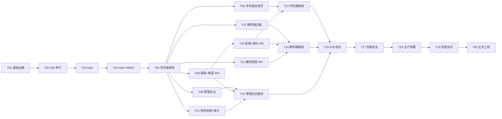

# Phase 2 — 前端优先开发计划

> **创建日期**: 2026-07-06  
> **策略**: 前端页面（Mock 数据）→ 后端接口实现 → 前后端联调  
> **前置**: Week 1 已完成（T01-T05：基础设施 + Auth + 学员端骨架）

---

## 一、策略说明

### 为什么选择"前端优先"？

| 优势 | 说明 |
|------|------|
| 👁️ **即时可见** | 每完成一个页面就能在浏览器看到效果 |
| 🎨 **UI 先行决策** | 先确定界面交互，后端接口按需设计 |
| 🔄 **快速反馈** | 页面用 mock 数据跑通，发现问题早 |
| 📐 **接口精准** | 前端定义需要的数据结构，后端按需实现 |
| 🚀 **降低返工** | 避免后端写完了前端用不上的情况 |

### 三阶段总览

```
Phase 1: 前端页面（Mock 数据）     Phase 2: 后端接口        Phase 3: 前后联调
─────────────────────────────────────────────────────────────────────────
  T06 学员端业务页                  T09 课程+教室 API         T13 学员端联调
  T07 教师端全套                    T10 排期+预约 API         T14 教师端联调
  T08 管理后台全套                  T11 教师档案 API          T15 管理后台联调
                                    T12 角色权限+审计 API
```

---

## 二、Phase 1：前端页面展示（Mock 数据驱动）

> **核心思路**：后端还没写，前端用 TypeScript 模拟数据，所有交互在浏览器跑通。

### T06 — 学员端业务页面（8h）

**目标**：学员端 5 个核心页面全部可交互，数据来自 mock

| 页面 | 路由 | Mock 数据 |
|------|------|-----------|
| 课程详情 | `/courses/:id` | 课程名称、封面、教师、难度、时长、价格 |
| 排期日历 | `/courses/:id/schedule` | 30 天日历 + 可预约时段（上午/下午/晚上） |
| 确认预约 | 弹窗组件 | 预约确认信息 |
| 我的预约 | `/my-bookings` | 预约列表 + 状态标签（已预约/已完成/已取消） |
| 个人中心 | `/profile` | 头像、昵称、手机号、会员卡信息 |

**新增文件**：

```
apps/student-web/src/
├── views/
│   ├── course-detail/index.vue     # 课程详情（封面/教师/难度/价格）
│   ├── schedule/index.vue          # 排期日历（日历组件 + 时段选择）
│   ├── booking-confirm/index.vue   # 预约确认弹窗
│   ├── my-bookings/index.vue       # 我的预约列表
│   └── profile/index.vue           # 个人中心
├── stores/
│   ├── course.ts                   # 课程状态
│   └── booking.ts                  # 预约状态
├── composables/
│   └── useMockData.ts              # Mock 数据管理
├── mock/
│   ├── courses.ts                  # 课程 mock 数据
│   ├── schedules.ts                # 排期 mock 数据
│   └── bookings.ts                 # 预约 mock 数据
└── router/index.ts                 # 新增路由
```

**成功标准**：
- 5 个页面在浏览器中全部可访问
- 从课程列表 → 课程详情 → 排期日历 → 确认预约 流程可走通
- 我的预约列表可展示不同状态
- TypeScript 0 error

---

### T07 — 教师端全套（8h）

**目标**：教师端完整项目搭建 + 6 个核心页面

| 页面 | 路由 | Mock 数据 |
|------|------|-----------|
| 登录 | `/teacher/login` | 复用学员端登录逻辑 |
| 我的课程 | `/teacher/courses` | 课程卡片列表（含状态标签） |
| 创建/编辑课程 | `/teacher/courses/create` | 表单（名称/封面/难度/时长/价格） |
| 排期管理 | `/teacher/schedule` | 日历 + 批量按周排期 |
| 学员列表 | `/teacher/students/:scheduleId` | 预约该节课的学员列表 |
| 教师档案 | `/teacher/profile` | 教师信息编辑 |

**新增文件**：

```
apps/teacher-web/                    # 新建项目（Vite + Vue3 + TS + Element Plus）
├── package.json
├── vite.config.ts
├── tsconfig.json
├── index.html
├── src/
│   ├── main.ts
│   ├── App.vue
│   ├── router/index.ts
│   ├── stores/
│   │   ├── auth.ts                 # 教师登录状态
│   │   ├── course.ts               # 课程管理
│   │   └── schedule.ts             # 排期管理
│   ├── views/
│   │   ├── login/index.vue
│   │   ├── courses/index.vue       # 我的课程列表
│   │   ├── courses/create.vue      # 创建/编辑课程
│   │   ├── schedule/index.vue      # 排期管理（日历）
│   │   ├── students/index.vue      # 预约学员列表
│   │   └── profile/index.vue       # 教师档案
│   ├── mock/
│   │   ├── courses.ts
│   │   ├── schedules.ts
│   │   └── students.ts
│   └── styles/index.scss
```

**成功标准**：
- 6 个页面全部可访问
- 创建课程 → 在我的课程列表可见
- 排期日历可展示 30 天 + 选择时段
- TypeScript 0 error

---

### T08 — 管理后台全套（8h）

**目标**：使用 Vben Admin 搭建管理后台，覆盖 8 个模块

| 模块 | 页面 | Mock 数据 |
|------|------|-----------|
| 用户管理 | 列表 + 新增/编辑 | 用户 CRUD |
| 角色权限 | 角色列表 + 权限树 | RBAC 管理 |
| 教师管理 | 列表 + 审核 | 教师档案 |
| 学员管理 | 列表 + 详情 | 学员档案 |
| 课程管理 | 列表 + 新增/编辑 | 课程 CRUD |
| 排期管理 | 日历 + 批量 | 排期视图 |
| 教室管理 | 列表 | 教室 CRUD |
| 机构设置 | 基本信息 | 租户编辑 |

**新增文件**：

```
apps/admin/                          # Vben Admin 脚手架
├── src/
│   ├── views/
│   │   ├── user/                    # 用户管理
│   │   ├── role/                    # 角色权限
│   │   ├── teacher/                 # 教师管理
│   │   ├── student/                 # 学员管理
│   │   ├── course/                  # 课程管理
│   │   ├── schedule/                # 排期管理
│   │   ├── classroom/               # 教室管理
│   │   └── tenant/                  # 机构设置
│   └── mock/
│       └── index.ts                 # 全局 mock 数据
```

**成功标准**：
- 8 个模块页面全部可访问
- CRUD 表单提交有反馈（mock）
- 菜单按角色显示（admin/teacher 不同菜单）
- build 通过

---

## 三、Phase 2：后端接口实现

> **核心思路**：页面已经确定了需要什么数据，按需实现后端 API。

### T09 — 课程 + 教室 API（8h）

**输入**：T06-T08 前端页面已经确定数据结构

| 接口 | 方法 | 路径 | 说明 |
|------|------|------|------|
| 课程列表 | GET | `/api/v1/courses` | 筛选 + 分页（状态/难度/教师/关键词） |
| 课程详情 | GET | `/api/v1/courses/:id` | 含排期概览 |
| 创建课程 | POST | `/api/v1/courses` | 教师权限 |
| 更新课程 | PATCH | `/api/v1/courses/:id` | 教师权限 |
| 删除课程 | DELETE | `/api/v1/courses/:id` | 软删除 |
| 教室列表 | GET | `/api/v1/classrooms` | 分页 |
| 创建教室 | POST | `/api/v1/classrooms` | 管理权限 |
| 更新教室 | PATCH | `/api/v1/classrooms/:id` | 管理权限 |
| 删除教室 | DELETE | `/api/v1/classrooms/:id` | 软删除 |

**输出**：
- `modules/course/`（router/service/repository/schemas）
- `modules/classroom/`（router/service/repository/schemas）
- `tests/integration/test_course_api.py`
- `tests/integration/test_classroom_api.py`

**成功标准**：
- 课程 CRUD 全过；教室不可重名
- 筛选/分页正确
- 集成测试通过

---

### T10 — 排期 + 预约 API（10h）

**输入**：T09 课程 API

| 接口 | 方法 | 路径 | 说明 |
|------|------|------|------|
| 创建排期 | POST | `/api/v1/schedules` | 单节创建 |
| 批量排期 | POST | `/api/v1/schedules/batch` | 按周规则批量生成 |
| 排期列表 | GET | `/api/v1/schedules` | 日历视图（按课程/日期筛选） |
| 取消排期 | DELETE | `/api/v1/schedules/:id` | 教师权限 |
| 创建预约 | POST | `/api/v1/bookings` | 学员权限 |
| 取消预约 | DELETE | `/api/v1/bookings/:id` | 本人取消 |
| 我的预约 | GET | `/api/v1/bookings/my` | 学员视角 |
| 预约学员 | GET | `/api/v1/bookings/schedule/:id` | 教师视角（含签到） |
| 签到 | PATCH | `/api/v1/bookings/:id/check-in` | 教师权限 |

**输出**：
- `modules/schedule/`（router/service/repository/schemas）
- `modules/booking/`（router/service/repository/schemas）
- 冲突检测算法（教师/教室时段冲突）
- Redis 锁 + 原子 UPDATE booked_count（防超额）
- 错误码 32001-32006

**成功标准**：
- 教师/教室时段冲突拒绝
- 批量排期跳过冲突日
- 100 并发抢 10 位 → 精确 10 成功 + 90 个 32001
- 重复预约返回 32002

---

### T11 — 教师档案 API（6h）

**输入**：T09 课程 API

| 接口 | 方法 | 路径 | 说明 |
|------|------|------|------|
| 教师列表 | GET | `/api/v1/teachers` | 管理视角（分页/筛选） |
| 教师详情 | GET | `/api/v1/teachers/:id` | 含课程数/学员数 |
| 创建档案 | POST | `/api/v1/teachers` | 自动绑定教师角色 |
| 更新档案 | PATCH | `/api/v1/teachers/:id` | 本人/管理 |
| 我的档案 | GET | `/api/v1/teachers/me` | 教师视角 |
| 更新我的档案 | PATCH | `/api/v1/teachers/me` | 教师视角 |

**输出**：
- `modules/teacher/`（router/service/repository/schemas）
- `tests/integration/test_teacher_api.py`

**成功标准**：
- 教师档案 CRUD 全过
- 创建档案自动绑定教师角色
- 集成测试通过

---

### T12 — 角色权限 + 审计 API（6h）

**输入**：已有 User/Role 模块基础

| 接口 | 方法 | 路径 | 说明 |
|------|------|------|------|
| 角色列表 | GET | `/api/v1/roles` | 分页 |
| 创建角色 | POST | `/api/v1/roles` | 管理权限 |
| 更新角色 | PATCH | `/api/v1/roles/:id` | 管理权限 |
| 删除角色 | DELETE | `/api/v1/roles/:id` | 管理权限 |
| 权限列表 | GET | `/api/v1/permissions` | 权限树 |
| 分配权限 | PUT | `/api/v1/roles/:id/permissions` | 覆盖式绑定 |
| 审计日志 | GET | `/api/v1/audit-logs` | 分页/筛选 |
| 机构设置 | GET | `/api/v1/tenant/settings` | 当前租户信息 |
| 更新机构 | PATCH | `/api/v1/tenant/settings` | 管理权限 |

**输出**：
- `modules/role/` 完善（已部分实现）
- `modules/tenant/`（router/service/repository）
- `tests/integration/test_rbac.py`

**成功标准**：
- 角色变更立即生效（清除 Redis 权限缓存）
- 无权访问返回 403
- 审计日志记录完整

---

## 四、Phase 3：前后端联调

### T13 — 学员端联调（6h）

**输入**：Phase 1 前端页面 + Phase 2 后端接口

**任务**：
- 替换全部 mock 数据为真实 API 调用
- 处理加载态（Skeleton/Loading）、空态（Empty）、错误态（Error Toast）
- 端到端链路验证：浏览课程 → 选排期 → 预约 → 我的预约

**成功标准**：
- 链路无报错；TypeScript 0 error
- 错误统一 Toast 提示
- 录屏存档

---

### T14 — 教师端联调（6h）

**输入**：T13

**任务**：
- 教师端 mock → 真实 API
- 链路验证：登录 → 创建课程 → 批量排期 → 查看学员 → 签到

**成功标准**：
- 链路完整；签到状态前后端一致
- 录屏存档

---

### T15 — 管理后台联调（6h）

**输入**：T14

**任务**：
- 管理后台 mock → 真实 API
- 链路验证：创建用户 → 分配教师角色 → 教师能登录并创建课程
- 权限菜单按角色显示

**成功标准**：
- 8 模块 CRUD 可用
- 菜单按角色动态显示
- 录屏存档

---

## 五、Phase 4：测试 + 部署 + 上线

> 保持原计划 T16-T20 不变

| Task | 内容 | 工时 |
|------|------|------|
| **T16** | E2E 测试 + P0/P1 修复 | 8h |
| **T17** | 性能/安全 review（OWASP + 慢查询 + 索引） | 6h |
| **T18** | 生产 Dockerfile + Nginx + HTTPS + Sentry | 8h |
| **T19** | 灰度部署 + 试点机构种子数据 + 烟测 | 8h |
| **T20** | 内测验收 + 文档 + 正式上线 | 6h |

---

## 六、任务依赖图



---

## 七、与原计划对比

| 维度 | 原计划（后端优先） | 新计划（前端优先） |
|------|-------------------|-------------------|
| **可见进度** | 前 5 天看不到 UI 变化 | 每天都有新页面可看 |
| **UI 决策** | 后端写完后才发现 UI 问题 | 先确定 UI，后端按需实现 |
| **接口设计** | 后端先定义，前端适应 | 前端定义需求，后端精准实现 |
| **并行能力** | 串行依赖强 | Phase 1 可独立推进 |
| **风险** | 后端写完了前端用不上 | Mock 数据可能与真实 API 有偏差 |

---

## 八、进度跟踪表

| Phase | Task | 内容 | 工时 | 状态 |
|-------|------|------|------|------|
| - | T01 | Monorepo + Docker | 6h | ✅ |
| - | T02 | DB 迁移 + 种子 | 8h | ✅ |
| - | T03 | Auth 模块 | 8h | ✅ |
| - | T04 | User + RBAC | 8h | ✅ |
| - | T05 | 学员端骨架 | 8h | ✅ |
| **1** | **T06** | **学员端业务页** | **8h** | ✅ 2026-07-06 |
| 1 | T07 | 教师端全套 | 8h | ✅ 2026-07-06 |
| 1 | T08 | 管理后台全套 | 8h | ✅ 2026-07-06 |
| **2** | **T09** | **课程 + 教室 API** | **8h** | ⏳ |
| 2 | T10 | 排期 + 预约 API | 10h | ⏳ |
| 2 | T11 | 教师档案 API | 6h | ⏳ |
| 2 | T12 | 角色权限 + 审计 | 6h | ⏳ |
| **3** | **T13** | **学员端联调** | **6h** | ⏳ |
| 3 | T14 | 教师端联调 | 6h | ⏳ |
| 3 | T15 | 管理后台联调 | 6h | ⏳ |
| **4** | **T16** | **E2E 测试** | **8h** | ⏳ |
| 4 | T17 | 性能安全 | 6h | ⏳ |
| 4 | T18 | 生产部署 | 8h | ⏳ |
| 4 | T19 | 灰度试点 | 8h | ⏳ |
| 4 | T20 | 正式上线 | 6h | ⏳ |
| **合计** | | | **154h** | |

---

## 九、快速开始

```bash
# Phase 1：启动前端开发（Mock 模式）
cd apps/student-web && pnpm dev    # 学员端 http://localhost:5174
cd apps/teacher-web && pnpm dev    # 教师端 http://localhost:5175
cd apps/admin-web && pnpm dev      # 管理后台 http://localhost:5173

# Phase 2：启动后端
cd apps/api && PYTHONPATH=src uv run uvicorn app.main:app --reload

# Phase 3：前后端联调
pnpm dev:api & pnpm dev:student & pnpm dev:teacher & pnpm dev:admin
```

---

## 十、相关文档

| 文档 | 路径 |
|------|------|
| 完整开发计划 | `class_booking_system_plan.md` |
| 项目 README | `README.md` |
| 本计划 | `docs/phase2_frontend_first_plan.md` |